# AI大时代的选专业求职创业大方向 #

[From:选专业求职必看，ai时代这些凉凉的行业就别去了](https://www.bilibili.com/video/BV1964y1T7gR)

论文《The Future of Employment》

美国47%工作岗位会被AI取代

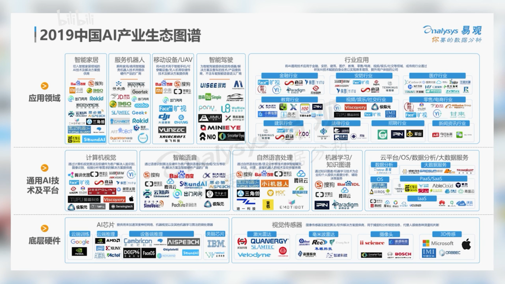

已被AI取代：电话广告推销员、演员（AI换脸）

## 职业未来发展前途分析框架 ##

世上的商业分析框架都不完美，要辩证分析，千万不要盲目照搬。

分析框架报告《Where machines could replace humans - and where they can't(yet)》内容

**现在大多人的工作时间的安排**

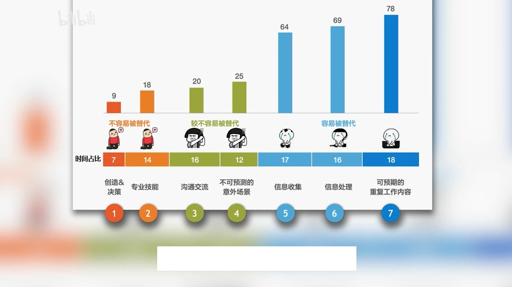

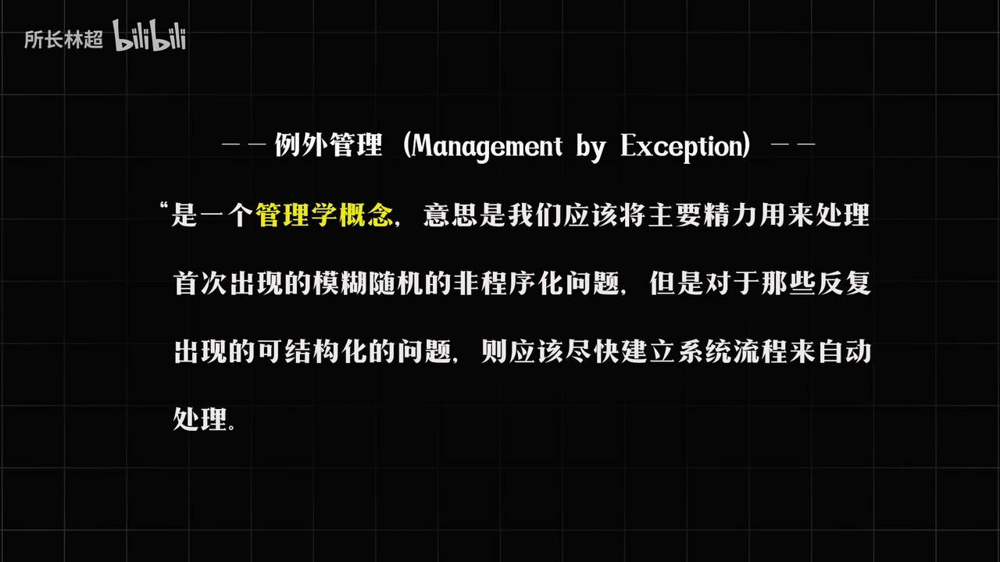

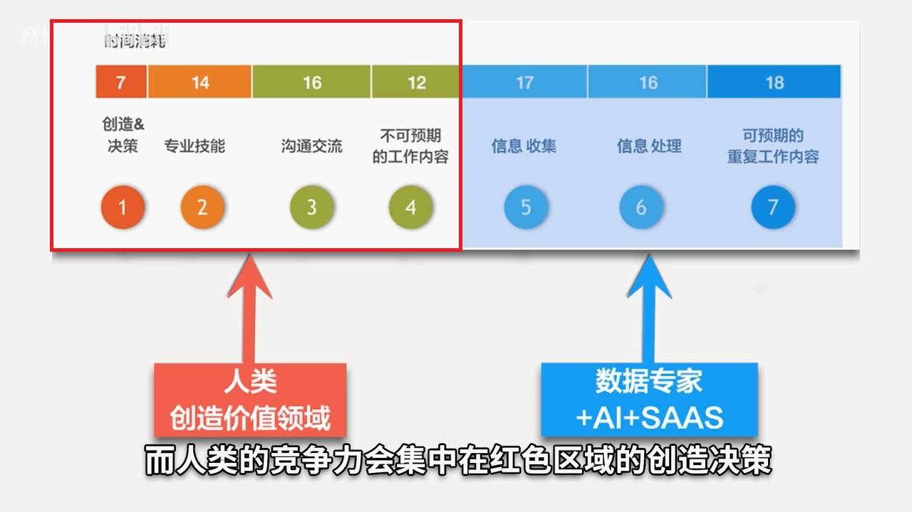

图中蓝色区域5、6、7工作将会被数据专家+AI+SAAS替代。

>SaaS，是Software-as-a-Service的缩写名称，意思为软件即服务，即通过网络提供软件服务。如，云Office。

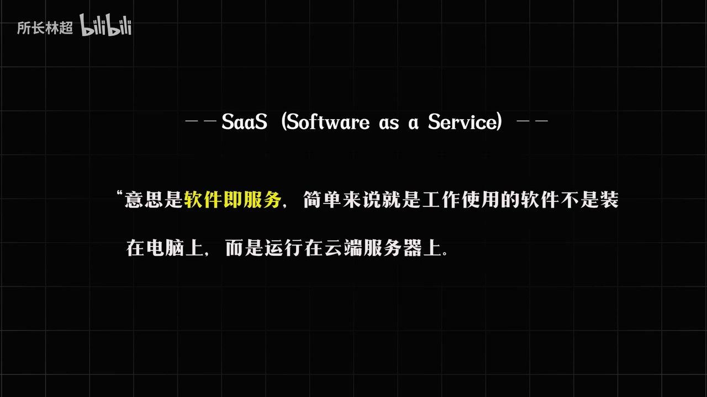

人类的竞争力会集中在红框区域1、2、3、4。

**要判断一个职业是否在未来有前途**，你可以分析它各个颜色的比例，如果发现蓝色区域大大高于50%，请尽快换工作或升级这工作类型，如律师助理。

律师会在红框区域。

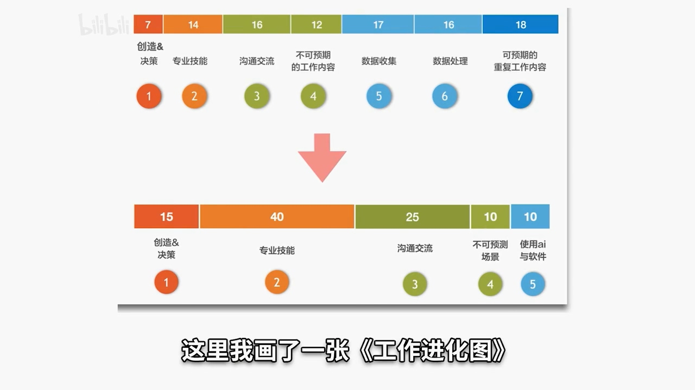

我们面向未来的两大策略：

1. 大胆拥抱新工具和新软件，对我们毫无价值的蓝色区域5、6、7，让它缩小到工作时间的20%以内，如：RPA（Robotic process automation 机器人流程自动化）机器人。
2. 我们要对红色和黄色区域发起持久的跨领域的进攻，在专业领域让自己达到专家水平。

在未来的竞争里面，一个领域你要么精专，要么撤退。

如果你信奉平均主义混日子，那就等着被人工智能干掉吧。

想要成为任何领域的大神，就像利用乐高积木搭建一座大厦，每一种形状的积木就是你不同类型的能力，你掌握的积木类型越多，你就更有可能会搭出超越常人的杰作。

**强调需要具备跨领域技能**

查理芒格：你若想在任何领域拥有竞争力，就必须熟练地掌握该领域的方方面面。这是人类大脑的深层结构决定的。

## 较难被AI替代的职业 ##

论文《The Future of Employment》算出702个职业的可替代性。

- 0表示机器完全不可替代。
- 1表示机器完全可替代

这些职业可以分成4大类

- 社交智慧型工作 

这些工作需要同理心、洞察力、表达能力等，人工智能无能为力

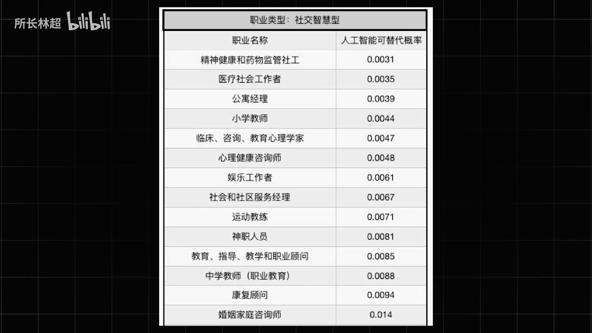

其中的教育行业占比较大

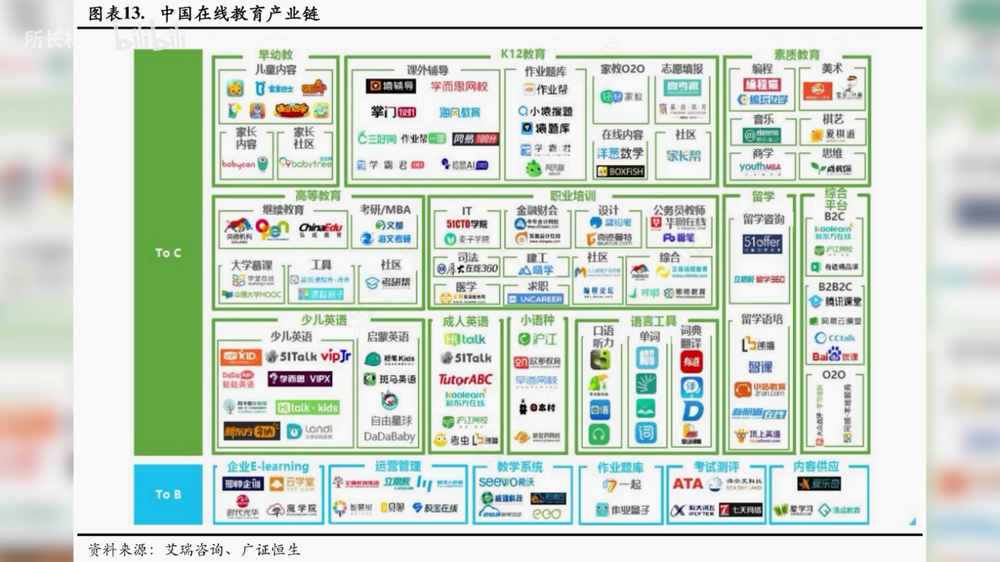

销售工作，因为人与人的信任只会越来越值钱。

另外是心理服务类，比如心理咨询师、婚姻咨询师、神职人员，娱乐工作者

- 创造型工作

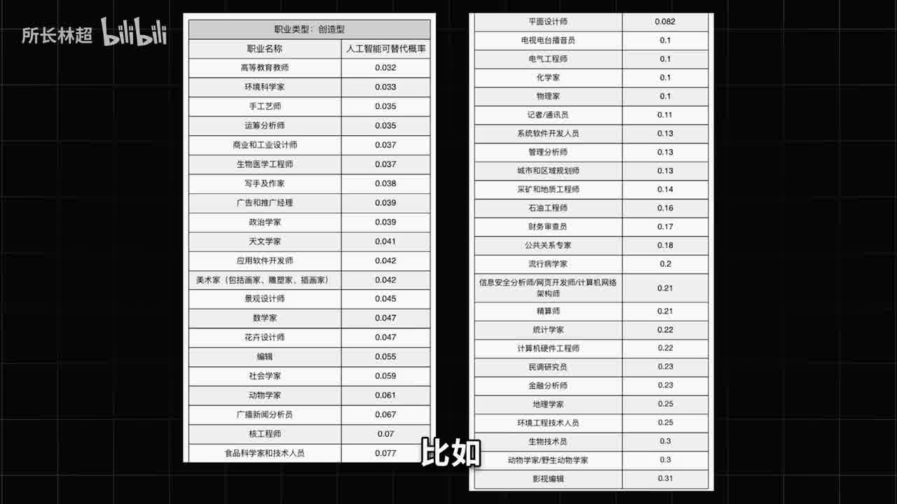

如优秀的写手，工程师，设计师，动画动效设计师，高等教育教师

- 感知操作型工作

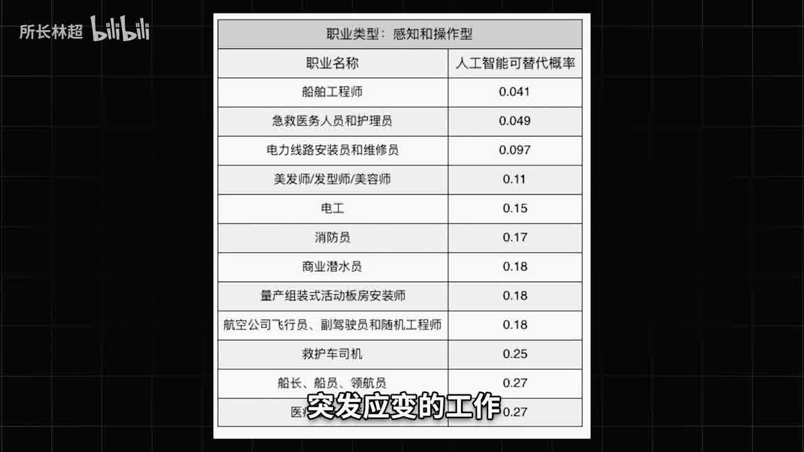

- 全能型工作

全能型并不是能力全都有的意思，主要是作者发现有很多职业，没法归到前面三个类别里去

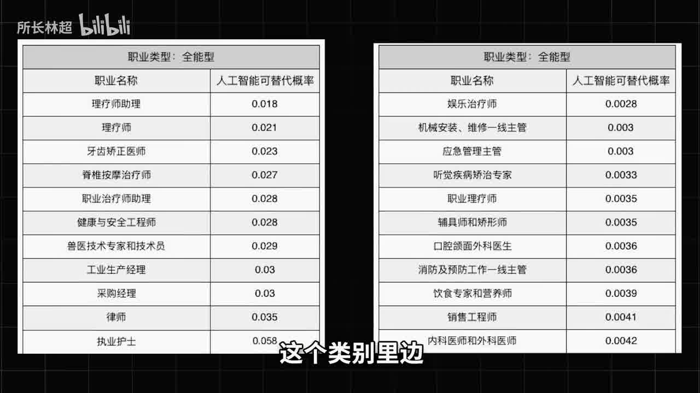

其中医疗健康类职业占据了半壁江山。

健康医疗这个领域在AI时代，真的具有极强的竞争，未来20年中国都会出现，人才严重供不应求的局面，一方面中国正在步入老龄社会，未来健康医疗类的需求只增不减，另一方面是报考医学院的人数却一直增长缓慢，供需错位是越来越严重。这意味着，医疗健康这类职业未来会持续得到高的溢价。

非常推荐大家持续关注这个行业。

进入一个行业，一定要记得结合上面的分析框架，仔细研究好职业方向。

## 总结 ##

六种具有竞争力的工作类型

1. 需要人与人深入沟通的工作，如教师、销售、心理专家
2. 需要强创造力的工作，如撰稿人、导演、设计师、工程师、作家
3. 用到高专业能力的工作，如医生、律师、行业专家、科学专家
4. 需要精细操作和灵活应变的工作，如手艺人、发型师、机器维修员
5. 需要做大量决策类的工作，如专业投资人、企业高管、政府官员
6. 实现智能化和网络化的工作，如数据科学家、算法专家、工程师、产品经理、运营专家

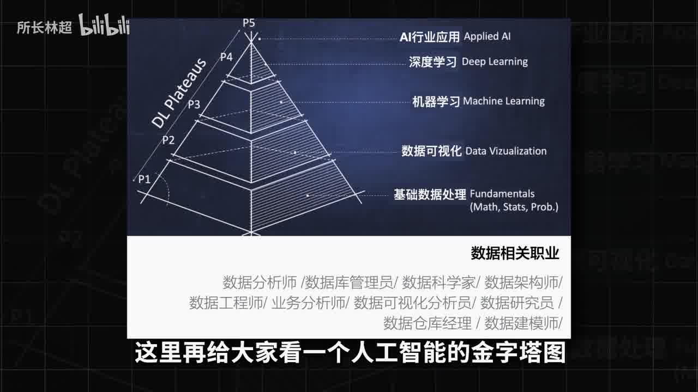

如果你想进入AI行业，其实最容易的切入点是从产业数据类岗位坐骑，而不是直接进AI公司干算法，现在AI算法创新红利早就过去了，而产业融合的机会却刚刚抬头，金融、教育、医疗、工业、农业、交通各个行业的数据岗位未来几年都会很缺人才，上图有很多数据岗位。

## 报告地址 ##

[Where machines could replace humans—and where they can’t (yet)](https://www.mckinsey.com/~/media/McKinsey/Business%20Functions/McKinsey%20Digital/Our%20Insights/Where%20machines%20could%20replace%20humans%20and%20where%20they%20cant/Where-machines-could-replace-humans-and-where-they-cant-yet.ashx)

[The Future of Employment](https://www.oxfordmartin.ox.ac.uk/downloads/academic/future-of-employment.pdf)

