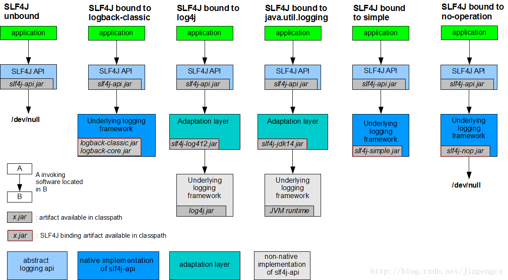

# SLF4J简介与使用(整合log4j) #

## 一、概念 ##

SLF4J的全称是Simple Logging Facade for Java，即简单日志门面。SLF4J并不是具体的日志框架，而是作为一个简单门面服务于各类日志框架，如java.util.logging, logback和log4j。

SLF4J提供了统一的记录日志的接口，对不同日志系统的具体实现进行了抽象化，只要按照其提供的方法记录即可，最终日志的格式、记录级别、输出方式等通过绑定具体的日志系统来实现。

使用SLF4J的好处在于，你只需要按统一的方式写记录日志的代码，如：

	public class LoggerTest {
	
	    private static final Logger logger = LoggerFactory.getLogger(Tester.class);
	
	    public static void main(String[] args) {
	        logger.info("Current Time: {}", System.currentTimeMillis());
	    }
	}

SLF4J支持{}作为占位符，等价于C语言中的%s，而不必再进行字符串的拼接，效率有显著的提升（见后面运行结果）。

而无需关心日志是通过哪个日志系统，以什么风格输出的。因为它们取决于部署项目时绑定的日志系统。 
例如，在项目中使用了SLF4J记录日志，并且绑定了log4j，则日志会以log4j的风格输出；后期需要改为以logback的风格输出日志，只需要将log4j替换成logback即可，不用修改项目中的代码。

## 二、依赖 ##

SLF4J绑定各类日志框架的原理图：

由上图可知，使用SLF4J依赖于slf4j-api-1.8.0-alpha2.jar，部署时还依赖于要绑定的日志系统的jar包和相应的适配器jar包。

以绑定log4j为例，需要导入以下包：

- slf4j-api-1.8.0-alpha2.jar
- log4j-1.2.17.jar
- slf4j-log4j12-1.8.0-alpha2.jar

如果使用Maven，则只需添加适配器jar包依赖即可

## 三、使用示例 ##

这里以SLF4J + log4j为例。

### 1.在pom.xml中添加依赖（或者手动导入上述3个jar包） ###

	<dependency>
	  <groupId>org.slf4j</groupId>
	  <artifactId>slf4j-log4j12</artifactId>
	  <version>1.8.0-alpha2</version>
	</dependency>

### 2.配置log4j ###
在类路径下创建log4j.properties配置文件，这样log4j会自动加载配置文件。

	# rootLogger参数分别为：根Logger级别，输出器stdout，输出器log
	log4j.rootLogger = info,stdout,log
	
	# 输出信息到控制台
	log4j.appender.stdout = org.apache.log4j.ConsoleAppender
	log4j.appender.stdout.layout = org.apache.log4j.PatternLayout
	log4j.appender.stdout.layout.ConversionPattern = %d [%-5p] %l %rms: %m%n
	
	# 输出DEBUG级别以上的日志到D://logs/debug.log
	log4j.appender.log = org.apache.log4j.DailyRollingFileAppender
	log4j.appender.log.DatePattern = '.'yyyy-MM-dd
	log4j.appender.log.File = D://debug.log
	log4j.appender.log.Encoding = UTF-8
	#log4j.appender.log.Threshold = INFO
	log4j.appender.log.layout = org.apache.log4j.PatternLayout
	log4j.appender.log.layout.ConversionPattern = %d [%-5p] (%c.%t): %m%n

将log4j.properties放在类路径下是最简单的做法，当然也可以通过PropertyConfigurator在代码中加载或者通过web.xml加载。

### 3.测试代码 ###

	import org.slf4j.Logger;
	import org.slf4j.LoggerFactory;
	
	public class LoggerTest {
	
	    private static final Logger logger = LoggerFactory.getLogger(LoggerTest.class);
	
	    public static void main(String[] args) {
	        logger.info("Current Time: {}", System.currentTimeMillis());
	        logger.info("Current Time: " + System.currentTimeMillis());
	        logger.info("Current Time: {}", System.currentTimeMillis());
	        logger.trace("trace log");
	        logger.warn("warn log");
	        logger.debug("debug log");
	        logger.info("info log");
	        logger.error("error log");
	    }
	}

### 4.运行结果 ###

	2018-09-01 23:14:32,690 [INFO ] com.lun.helloslf4j.LoggerTest.main(LoggerTest.java:11) 2ms: Current Time: 1535814872683
	2018-09-01 23:14:32,700 [INFO ] com.lun.helloslf4j.LoggerTest.main(LoggerTest.java:12) 12ms: Current Time: 1535814872700
	2018-09-01 23:14:32,701 [INFO ] com.lun.helloslf4j.LoggerTest.main(LoggerTest.java:13) 13ms: Current Time: 1535814872701
	2018-09-01 23:14:32,701 [WARN ] com.lun.helloslf4j.LoggerTest.main(LoggerTest.java:15) 13ms: warn log
	2018-09-01 23:14:32,701 [INFO ] com.lun.helloslf4j.LoggerTest.main(LoggerTest.java:17) 13ms: info log
	2018-09-01 23:14:32,701 [ERROR] com.lun.helloslf4j.LoggerTest.main(LoggerTest.java:18) 13ms: error log

通常输出日志开销非常大，从上述结果可见，SLF4J通过{}作为占位符的方式输出字符串，相比字符串拼接的方式，效率有显著的提升。

### 5.更换日志系统 ###
看到这里，你可能会有疑问：既然都用了log4j，为什么还要用SLF4J来写记录日志的代码呢，不是多此一举吗？

答案是否定的。假设我们不再需要log4j，而是希望改为使用java自带logging记录日志，我们需要做的仅仅是将pom.xml的依赖项slf4j-log4j12改为slf4j-jdk14即可，无需对上述测试代码做任何修改。

	<dependency>
	  <groupId>org.slf4j</groupId>
	  <artifactId>slf4j-jdk14</artifactId>
	  <version>1.8.0-alpha2</version>
	</dependency>

是的，就是这么简单。再次运行测试代码：

	九月 01, 2018 11:25:35 下午 com.lun.helloslf4j.LoggerTest main
	信息: Current Time: 1535815535309
	九月 01, 2018 11:25:35 下午 com.lun.helloslf4j.LoggerTest main
	信息: Current Time: 1535815535475
	九月 01, 2018 11:25:35 下午 com.lun.helloslf4j.LoggerTest main
	信息: Current Time: 1535815535477
	九月 01, 2018 11:25:35 下午 com.lun.helloslf4j.LoggerTest main
	警告: warn log
	九月 01, 2018 11:25:35 下午 com.lun.helloslf4j.LoggerTest main
	信息: info log
	九月 01, 2018 11:25:35 下午 com.lun.helloslf4j.LoggerTest main
	严重: error log

我们发现，此时日志已经变为以logging的方式输出。

# 四、总结 #
SLF4J的使用非常简单，甚至连官网上都说鉴于它太轻量，文档篇幅不长。

>Given the small size of SLF4J, its documentation is not very lengthy.

在《阿里巴巴Java开发手册(正式版)》中，日志规约一项第一条就强制要求使用SLF4J：

>【强制】应用中不可直接使用日志系统（Log4j、Logback）中的API，而应依赖使用日志框架SLF4J中的API，使用门面模式的日志框架，有利于维护和各个类的日志处理方式统一。

所以从现在开始使用SLF4J吧！

# 引用 #

[来源处](https://blog.csdn.net/jiapengcs/article/details/73359918)

[官方文档](https://www.slf4j.org/manual.html)
