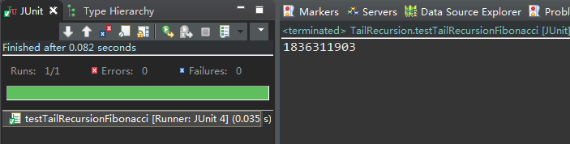

# Tail Recursion尾递归 #

creation date:2020-03-15 17: 05: 56

tag:Algorithm

## 什么是尾递归 ##

Tail Recursion /teɪl rɪˈkɜːrʒn/

In **traditional recursion**, the typical model is that you perform your recursive calls first, and then you take the return value of the recursive call and calculate the result. In this manner, you don't get the result of your calculation until you have returned from every recursive call.

In **tail recursion**, you perform your calculations first, and then you execute the recursive call, passing the results of your current step to the next recursive step. This results in the last statement being in the form of (`return (recursive-function params)`). **Basically, the return value of any given recursive step is the same as the return value of the next recursive call**.

## 示例一 : 累加 ##

Consider a simple function that adds the first N integers. (e.g. `sum(5) = 1 + 2 + 3 + 4 + 5 = 15`).

Here is a simple JavaScript implementation that uses recursion:

```javascript
function recsum(x) {
    if (x === 1) {
        return x;
    } else {
        return x + recsum(x - 1);
    }
}
```

If you called `recsum(5)`, this is what the JavaScript interpreter would evaluate:

```
recsum(5)
5 + recsum(4)
5 + (4 + recsum(3))
5 + (4 + (3 + recsum(2)))
5 + (4 + (3 + (2 + recsum(1))))
5 + (4 + (3 + (2 + 1)))
15
```

Note how every recursive call has to complete before the JavaScript interpreter begins to actually do the work of calculating the sum.

Here's a tail-recursive version of the same function:

```
function tailrecsum(x, running_total = 0) {
    if (x === 0) {
        return running_total;
    } else {
        return tailrecsum(x - 1, running_total + x);
    }
}
```

Here's the sequence of events that would occur if you called `tailrecsum(5)`, (which would effectively be `tailrecsum(5, 0)`, because of the default second argument).

```
tailrecsum(5, 0)
tailrecsum(4, 5)
tailrecsum(3, 9)
tailrecsum(2, 12)
tailrecsum(1, 14)
tailrecsum(0, 15)
15
```

In the tail-recursive case, with each evaluation of the recursive call, the `running_total` is updated.

## 示例二 : 斐波那契数列##

在数学上，斐波那契数列以如下被以递推的方法定义：F(1)=1，F(2)=1, F(n)=F(n - 1)+F(n - 2)（n ≥ 3，n ∈ N*）。

换成Java代码如下：

```java
public static long classicFibonacci(long num) {
	if(num <= 0) {
		return 0;
	}else if(num == 1 || num == 2) {
		return 1;
	}else {
		return classicFibonacci(num - 1) + classicFibonacci(num - 2);
	}
}
```

用尾递归方法改造一下

```java
public static long tailRecursionFibonacci(long num) {
	if(num <= 0) {
		return 0;
	}else if(num == 1 || num == 2) {
		return 1;
	}else {
		return tailRecursionFibonacci(num, 1, 1, 2);
	}
}

public static long tailRecursionFibonacci(long num, long first, long second, long index) {
	if(num == index) {
		return second;
	}else {
		return tailRecursionFibonacci(num, second, first + second, index + 1);//尾递归调用
	}
}
```

## 为什么需要尾递归 ##

因为性能。

The consequence of **tail recursion** is that once you are ready to perform your next recursive step, you don't need the current stack frame any more. This allows for some optimization. In fact, with an appropriately written compiler, you should never have a stack overflow snicker with a tail recursive call. Simply reuse the current stack frame for the next recursive step.

那么，我们不妨测试一下[示例二：斐波那契数列](#)中两种算法。测试方法是用两种算法得出斐波那契数列的第46项是多少且分别消耗多长时间。

首先，用`classicFibonacci`计算得出斐波那契数列的第46项。

```java
@Test
public void testClassicFibonacci() {
	System.out.println(classicFibonacci(46));
}
```

运行结果如下


斐波那契数列的第46项是1836311903，用`classicFibonacci`得出斐波那契数列的第46项所消耗的时间是43.026秒

---

接着，用有**尾递归方式**的`tailRecursionFibonacci`计算得出斐波那契数列的第46项。

```java
@Test
public void testTailRecursionFibonacci() {
	System.out.println(tailRecursionFibonacci(46));
}
```



斐波那契数列的第46项是1836311903，跟`classicFibonacci`的一致。用有尾递归方式的`tailRecursionFibonacci`得出斐波那契数列的第46项所消耗的时间是0.035秒，是`classicFibonacci`的1229倍，差距悬殊。

如果继续用`classicFibonacci`得出斐波那契数列第n项（n>46），将消耗更长时间，甚至天荒地老也没有算完。

## 参考资料 ##

1. [What is tail recursion?](https://stackoverflow.com/questions/33923/what-is-tail-recursion)
2. [斐波那契数列](https://baike.baidu.com/item/斐波那契数列/99145?fr=aladdin)

