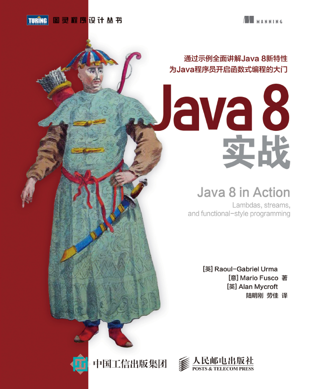

# 《Java8实战》学习笔记 #

creation date:2020-02-10 11: 25: 42

tag:Java

# Java8实战 #

## 第一部分 基础知识 ##

[1.](#1)[为什么要关心Java8](https://github.com/JallenKwong/LearnJava8/tree/master/src/main/java/com/lun/c01)

[2.](#2)[通过行为参数化传递代码](https://github.com/JallenKwong/LearnJava8/tree/master/src/main/java/com/lun/c02)

[3.](#3)[Lambda 表达式](https://github.com/JallenKwong/LearnJava8/tree/master/src/main/java/com/lun/c03)

## 第二部分 函数式数据处理 ##

[4.](#4)[引入流](https://github.com/JallenKwong/LearnJava8/tree/master/src/main/java/com/lun/c04)

[5.](#5)[使用流](https://github.com/JallenKwong/LearnJava8/tree/master/src/main/java/com/lun/c05)

[6.](#6)[用流收集数据](https://github.com/JallenKwong/LearnJava8/tree/master/src/main/java/com/lun/c06)

[7.](#7)[并行数据处理与性能](https://github.com/JallenKwong/LearnJava8/tree/master/src/main/java/com/lun/c07)

## 第三部分 高效Java 8编程 ##

[8.](#8)[重构、测试和调试](https://github.com/JallenKwong/LearnJava8/tree/master/src/main/java/com/lun/c08)

[9.](#9)[默认方法](https://github.com/JallenKwong/LearnJava8/tree/master/src/main/java/com/lun/c09)

[10.](#10)[用Optional取代null](https://github.com/JallenKwong/LearnJava8/tree/master/src/main/java/com/lun/c10)

[11.](#11)[CompletableFuture：组合式异步编程](https://github.com/JallenKwong/LearnJava8/tree/master/src/main/java/com/lun/c11)

[12.](#12)[新的日期和时间API](https://github.com/JallenKwong/LearnJava8/tree/master/src/main/java/com/lun/c12)

## 第四部分 超越Java 8 ##

[13.](#13)[函数式的思考](https://github.com/JallenKwong/LearnJava8/tree/master/src/main/java/com/lun/c13)

[14.](#14)[函数式编程的技巧](https://github.com/JallenKwong/LearnJava8/tree/master/src/main/java/com/lun/c14)

[15.](#15)[面向对象和函数式编程的混合：Java 8和Scala的比较](https://github.com/JallenKwong/LearnJava8/tree/master/src/main/java/com/lun/c15)

[16.](#16)[结论以及Java的未来](https://github.com/JallenKwong/LearnJava8/tree/master/src/main/java/com/lun/c16)

---

## 第一部分 基础知识 ##

### 1 ###

[1.为什么要关心Java8](https://github.com/JallenKwong/LearnJava8/tree/master/src/main/java/com/lun/c01)

[1.1.Java 怎么还在变](https://github.com/JallenKwong/LearnJava8/tree/master/src/main/java/com/lun/c01#java怎么还在变)

[1.1.1.Java 在编程语言生态系统中的位置](https://github.com/JallenKwong/LearnJava8/tree/master/src/main/java/com/lun/c01#java在编程语言生态系统中的位置)

[1.1.2.流处理](https://github.com/JallenKwong/LearnJava8/tree/master/src/main/java/com/lun/c01#流处理)

[1.1.3.用行为参数化把代码传递给方法](https://github.com/JallenKwong/LearnJava8/tree/master/src/main/java/com/lun/c01#用行为参数化把代码传递给方法)

[1.1.4.并行与共享的可变数据](https://github.com/JallenKwong/LearnJava8/tree/master/src/main/java/com/lun/c01#并行与共享的可变数据)

[1.1.5.Java 需要演变](https://github.com/JallenKwong/LearnJava8/tree/master/src/main/java/com/lun/c01#java需要演变)

[1.2.Java 中的函数](https://github.com/JallenKwong/LearnJava8/tree/master/src/main/java/com/lun/c01#java中的函数)

[1.2.1.方法和Lambda 作为一等公民](https://github.com/JallenKwong/LearnJava8/tree/master/src/main/java/com/lun/c01#方法和lambda作为一等公民)

[1.2.2.传递代码：一个例子](https://github.com/JallenKwong/LearnJava8/tree/master/src/main/java/com/lun/c01#传递代码一个例子)

[1.2.3.从传递方法到Lambda](https://github.com/JallenKwong/LearnJava8/tree/master/src/main/java/com/lun/c01#从传递方法到lambda)

[1.3.流](https://github.com/JallenKwong/LearnJava8/tree/master/src/main/java/com/lun/c01#流)

[1.3.1.多线程并非易事](https://github.com/JallenKwong/LearnJava8/tree/master/src/main/java/com/lun/c01#多线程并非易事)

[1.4.默认方法](https://github.com/JallenKwong/LearnJava8/tree/master/src/main/java/com/lun/c01#默认方法)

[1.5.来自函数式编程的其他好思想](https://github.com/JallenKwong/LearnJava8/tree/master/src/main/java/com/lun/c01#来自函数式编程的其他好思想)

### 2 ###

[2.通过行为参数化传递代码](https://github.com/JallenKwong/LearnJava8/tree/master/src/main/java/com/lun/c02)

[2.1.应对不断变化的需求](https://github.com/JallenKwong/LearnJava8/tree/master/src/main/java/com/lun/c02#应对不断变化的需求)

[2.1.1.初试牛刀：筛选绿苹果](https://github.com/JallenKwong/LearnJava8/tree/master/src/main/java/com/lun/c02#初试牛刀筛选绿苹果)

[2.1.2.再展身手：把颜色作为参数](https://github.com/JallenKwong/LearnJava8/tree/master/src/main/java/com/lun/c02#再展身手把颜色作为参数)

[2.1.3.第三次尝试：对你能想到的每个属性做筛选](https://github.com/JallenKwong/LearnJava8/tree/master/src/main/java/com/lun/c02#第三次尝试对你能想到的每个属性做筛选)

[2.2.行为参数化](https://github.com/JallenKwong/LearnJava8/tree/master/src/main/java/com/lun/c02#行为参数化)

[2.2.1.第四次尝试：根据抽象条件筛选](https://github.com/JallenKwong/LearnJava8/tree/master/src/main/java/com/lun/c02#第四次尝试根据抽象条件筛选)

[2.2.1.1.传递代码/行为](https://github.com/JallenKwong/LearnJava8/tree/master/src/main/java/com/lun/c02#传递代码行为)

[2.2.1.2.多种行为，一个参数](https://github.com/JallenKwong/LearnJava8/tree/master/src/main/java/com/lun/c02#多种行为一个参数)

[2.3.对付啰嗦](https://github.com/JallenKwong/LearnJava8/tree/master/src/main/java/com/lun/c02#对付啰嗦)

[2.3.1.匿名类](https://github.com/JallenKwong/LearnJava8/tree/master/src/main/java/com/lun/c02#匿名类)

[2.3.2.第五次尝试：使用匿名类](https://github.com/JallenKwong/LearnJava8/tree/master/src/main/java/com/lun/c02#第五次尝试使用匿名类)

[2.3.3.第六次尝试：使用Lambda 表达式](https://github.com/JallenKwong/LearnJava8/tree/master/src/main/java/com/lun/c02#第六次尝试使用lambda表达式)

[2.3.4.第七次尝试：将List 类型抽象化](https://github.com/JallenKwong/LearnJava8/tree/master/src/main/java/com/lun/c02#第七次尝试将list类型抽象化)

[2.4.真实的例子](https://github.com/JallenKwong/LearnJava8/tree/master/src/main/java/com/lun/c02#真实的例子)

[2.4.1.用Comparator来排序](https://github.com/JallenKwong/LearnJava8/tree/master/src/main/java/com/lun/c02#用comparator来排序)

[2.4.2.用Runnable执行代码块](https://github.com/JallenKwong/LearnJava8/tree/master/src/main/java/com/lun/c02#用runnable执行代码块)

[2.4.3.GUI 事件处理](https://github.com/JallenKwong/LearnJava8/tree/master/src/main/java/com/lun/c02#gui事件处理)

[2.5.小结](https://github.com/JallenKwong/LearnJava8/tree/master/src/main/java/com/lun/c02#小结)

### 3 ###

[3.Lambda 表达式](https://github.com/JallenKwong/LearnJava8/tree/master/src/main/java/com/lun/c03)

[3.1.Lambda 管中窥豹](https://github.com/JallenKwong/LearnJava8/tree/master/src/main/java/com/lun/c03#lambda管中窥豹)

[3.2.在哪里以及如何使用Lambda](https://github.com/JallenKwong/LearnJava8/tree/master/src/main/java/com/lun/c03#在哪里以及如何使用lambda)

[3.2.1.函数式接口](https://github.com/JallenKwong/LearnJava8/tree/master/src/main/java/com/lun/c03#函数式接口)

[3.2.2.函数描述符](https://github.com/JallenKwong/LearnJava8/tree/master/src/main/java/com/lun/c03#函数描述符)

[3.3.把Lambda 付诸实践：环绕执行模式](https://github.com/JallenKwong/LearnJava8/tree/master/src/main/java/com/lun/c03#把lambda付诸实践环绕执行模式)

[3.3.1.第1步：记得行为参数化](https://github.com/JallenKwong/LearnJava8/tree/master/src/main/java/com/lun/c03#第1步记得行为参数化)

[3.3.2.第2步：使用函数式接口来传递行为](https://github.com/JallenKwong/LearnJava8/tree/master/src/main/java/com/lun/c03#第2步使用函数式接口来传递行为)

[3.3.3.第3步：执行一个行为](https://github.com/JallenKwong/LearnJava8/tree/master/src/main/java/com/lun/c03#第3步执行一个行为)

[3.3.4.第4步：传递Lambda](https://github.com/JallenKwong/LearnJava8/tree/master/src/main/java/com/lun/c03#第4步传递lambda)

[3.4.使用函数式接口](https://github.com/JallenKwong/LearnJava8/tree/master/src/main/java/com/lun/c03#使用函数式接口)

[3.4.1.Predicate](https://github.com/JallenKwong/LearnJava8/tree/master/src/main/java/com/lun/c03#predicate)

[3.4.2.Consumer](https://github.com/JallenKwong/LearnJava8/tree/master/src/main/java/com/lun/c03#consumer)

[3.4.3.Function](https://github.com/JallenKwong/LearnJava8/tree/master/src/main/java/com/lun/c03#function)

[3.4.4.原始类型特化](https://github.com/JallenKwong/LearnJava8/tree/master/src/main/java/com/lun/c03#原始类型特化)

[3.4.5.异常](https://github.com/JallenKwong/LearnJava8/tree/master/src/main/java/com/lun/c03#异常)

[3.5.类型检查、类型推断以及限制](https://github.com/JallenKwong/LearnJava8/tree/master/src/main/java/com/lun/c03#类型检查类型推断以及限制)

[3.5.1.类型检查](https://github.com/JallenKwong/LearnJava8/tree/master/src/main/java/com/lun/c03#类型检查)

[3.5.2.同样的Lambda，不同的函数式接口](https://github.com/JallenKwong/LearnJava8/tree/master/src/main/java/com/lun/c03#同样的lambda不同的函数式接口)

[3.5.3.类型推断](https://github.com/JallenKwong/LearnJava8/tree/master/src/main/java/com/lun/c03#类型推断)

[3.5.4.使用局部变量](https://github.com/JallenKwong/LearnJava8/tree/master/src/main/java/com/lun/c03#使用局部变量)

[3.6.方法引用](https://github.com/JallenKwong/LearnJava8/tree/master/src/main/java/com/lun/c03#方法引用)

[3.6.1.管中窥豹](https://github.com/JallenKwong/LearnJava8/tree/master/src/main/java/com/lun/c03#管中窥豹)

[3.6.1.1.如何构建方法引用](https://github.com/JallenKwong/LearnJava8/tree/master/src/main/java/com/lun/c03#如何构建方法引用)

[3.6.2.构造函数引用](https://github.com/JallenKwong/LearnJava8/tree/master/src/main/java/com/lun/c03#构造函数引用)

[3.7.Lambda和方法引用实战](https://github.com/JallenKwong/LearnJava8/tree/master/src/main/java/com/lun/c03#lambda和方法引用实战)

[3.7.1.第1步：传递代码](https://github.com/JallenKwong/LearnJava8/tree/master/src/main/java/com/lun/c03#第1步传递代码)

[3.7.2.第2步：使用匿名类](https://github.com/JallenKwong/LearnJava8/tree/master/src/main/java/com/lun/c03#第2步使用匿名类)

[3.7.3.第3步：使用Lambda表达式](https://github.com/JallenKwong/LearnJava8/tree/master/src/main/java/com/lun/c03#第3步使用lambda表达式)

[3.7.4.第4步：使用方法引用](https://github.com/JallenKwong/LearnJava8/tree/master/src/main/java/com/lun/c03#第4步使用方法引用)

[3.8.复合Lambda表达式的有用的方法](https://github.com/JallenKwong/LearnJava8/tree/master/src/main/java/com/lun/c03#复合lambda表达式的有用的方法)

[3.8.1.比较器复合](https://github.com/JallenKwong/LearnJava8/tree/master/src/main/java/com/lun/c03#比较器复合)

[3.8.1.1.逆序](https://github.com/JallenKwong/LearnJava8/tree/master/src/main/java/com/lun/c03#逆序)

[3.8.1.2.比较器链](https://github.com/JallenKwong/LearnJava8/tree/master/src/main/java/com/lun/c03#比较器链)

[3.8.2.谓词复合](https://github.com/JallenKwong/LearnJava8/tree/master/src/main/java/com/lun/c03#谓词复合)

[3.8.3.函数复合](https://github.com/JallenKwong/LearnJava8/tree/master/src/main/java/com/lun/c03#函数复合)

[3.8.4.数学中类似的思想](https://github.com/JallenKwong/LearnJava8/tree/master/src/main/java/com/lun/c03#数学中类似的思想)

[3.9.小结](https://github.com/JallenKwong/LearnJava8/tree/master/src/main/java/com/lun/c03#小结)

## 第二部分 函数式数据处理 ##

### 4 ###

[4.引入流](https://github.com/JallenKwong/LearnJava8/tree/master/src/main/java/com/lun/c04)

[4.1.流是什么](https://github.com/JallenKwong/LearnJava8/tree/master/src/main/java/com/lun/c04#流是什么)

[4.2.流简介](https://github.com/JallenKwong/LearnJava8/tree/master/src/main/java/com/lun/c04#流简介)

[4.3.流与集合](https://github.com/JallenKwong/LearnJava8/tree/master/src/main/java/com/lun/c04#流与集合)

[4.3.1.只能遍历一次](https://github.com/JallenKwong/LearnJava8/tree/master/src/main/java/com/lun/c04#只能遍历一次)

[4.3.2.外部迭代与内部迭代](https://github.com/JallenKwong/LearnJava8/tree/master/src/main/java/com/lun/c04#外部迭代与内部迭代)

[4.4.流操作](https://github.com/JallenKwong/LearnJava8/tree/master/src/main/java/com/lun/c04#流操作)

[4.4.1.中间操作](https://github.com/JallenKwong/LearnJava8/tree/master/src/main/java/com/lun/c04#中间操作)

[4.4.2.终端操作](https://github.com/JallenKwong/LearnJava8/tree/master/src/main/java/com/lun/c04#终端操作)

[4.4.3.使用流](https://github.com/JallenKwong/LearnJava8/tree/master/src/main/java/com/lun/c04#使用流)

[4.5.小结](https://github.com/JallenKwong/LearnJava8/tree/master/src/main/java/com/lun/c04#小结)

### 5 ###

[5.使用流](https://github.com/JallenKwong/LearnJava8/tree/master/src/main/java/com/lun/c05)

[5.1.筛选和切片](https://github.com/JallenKwong/LearnJava8/tree/master/src/main/java/com/lun/c05#筛选和切片)

[5.1.1.用谓词Predicate筛选-filter](https://github.com/JallenKwong/LearnJava8/tree/master/src/main/java/com/lun/c05#用谓词predicate筛选filter)

[5.1.2.筛选各异的元素-去重-distinct](https://github.com/JallenKwong/LearnJava8/tree/master/src/main/java/com/lun/c05#筛选各异的元素去重distinct)

[5.1.3.截短流-limit](https://github.com/JallenKwong/LearnJava8/tree/master/src/main/java/com/lun/c05#截短流limit)

[5.1.4.跳过元素-skip](https://github.com/JallenKwong/LearnJava8/tree/master/src/main/java/com/lun/c05#跳过元素skip)

[5.2.映射-map](https://github.com/JallenKwong/LearnJava8/tree/master/src/main/java/com/lun/c05#映射map)

[5.2.1.对流中每一个元素应用函数-map](https://github.com/JallenKwong/LearnJava8/tree/master/src/main/java/com/lun/c05#对流中每一个元素应用函数map)

[5.2.2.流的扁平化-flatMap](https://github.com/JallenKwong/LearnJava8/tree/master/src/main/java/com/lun/c05#流的扁平化flatmap)

[5.2.2.1.更多流的扁平化例子](https://github.com/JallenKwong/LearnJava8/tree/master/src/main/java/com/lun/c05#更多流的扁平化例子)

[5.3.查找和匹配-find-match](https://github.com/JallenKwong/LearnJava8/tree/master/src/main/java/com/lun/c05#查找和匹配findmatch)

[5.3.1.检查谓词是否至少匹配一个元素-anyMatch](https://github.com/JallenKwong/LearnJava8/tree/master/src/main/java/com/lun/c05#检查谓词是否至少匹配一个元素anymatch)

[5.3.2.检查谓词是否匹配所有元素-allMatch](https://github.com/JallenKwong/LearnJava8/tree/master/src/main/java/com/lun/c05#检查谓词是否匹配所有元素allmatch)

[5.3.3.检查谓词是否不匹配所有元素-noneMatch](https://github.com/JallenKwong/LearnJava8/tree/master/src/main/java/com/lun/c05#检查谓词是否不匹配所有元素nonematch)

[5.3.4.查找元素-findAny](https://github.com/JallenKwong/LearnJava8/tree/master/src/main/java/com/lun/c05#查找元素findany)

[5.3.4.1.Optional一览](https://github.com/JallenKwong/LearnJava8/tree/master/src/main/java/com/lun/c05#optional一览)

[5.3.5.查找第一个元素-findFirst](https://github.com/JallenKwong/LearnJava8/tree/master/src/main/java/com/lun/c05#查找第一个元素findfirst)

[5.3.6.何时使用findFirst和findAny](https://github.com/JallenKwong/LearnJava8/tree/master/src/main/java/com/lun/c05#何时使用findfirst和findany)

[5.4.归约-reduce](https://github.com/JallenKwong/LearnJava8/tree/master/src/main/java/com/lun/c05#归约reduce)

[5.4.1.元素求和](https://github.com/JallenKwong/LearnJava8/tree/master/src/main/java/com/lun/c05#元素求和)

[5.4.2.元素求积](https://github.com/JallenKwong/LearnJava8/tree/master/src/main/java/com/lun/c05#元素求积)

[5.4.3.最大值和最小值](https://github.com/JallenKwong/LearnJava8/tree/master/src/main/java/com/lun/c05#最大值和最小值)

[5.4.4.总数](https://github.com/JallenKwong/LearnJava8/tree/master/src/main/java/com/lun/c05#总数)

[5.4.5.归约方法的优势与并行化](https://github.com/JallenKwong/LearnJava8/tree/master/src/main/java/com/lun/c05#归约方法的优势与并行化)

[5.4.6.流操作：无状态和有状态](https://github.com/JallenKwong/LearnJava8/tree/master/src/main/java/com/lun/c05#流操作无状态和有状态)

[5.4.7.中间操作和终端操作小结](https://github.com/JallenKwong/LearnJava8/tree/master/src/main/java/com/lun/c05#中间操作和终端操作小结)

[5.5.付诸实践](https://github.com/JallenKwong/LearnJava8/tree/master/src/main/java/com/lun/c05#付诸实践)

[5.5.1.领域：交易员和交易](https://github.com/JallenKwong/LearnJava8/tree/master/src/main/java/com/lun/c05#领域交易员和交易)

[5.5.2.解答](https://github.com/JallenKwong/LearnJava8/tree/master/src/main/java/com/lun/c05#解答)

[5.6.数值流](https://github.com/JallenKwong/LearnJava8/tree/master/src/main/java/com/lun/c05#数值流)

[5.6.1.原始类型流特化](https://github.com/JallenKwong/LearnJava8/tree/master/src/main/java/com/lun/c05#原始类型流特化)

[5.6.1.1.映射到数值流-mapToXXX](https://github.com/JallenKwong/LearnJava8/tree/master/src/main/java/com/lun/c05#映射到数值流maptoxxx)

[5.6.1.2.转换回对象流-boxed](https://github.com/JallenKwong/LearnJava8/tree/master/src/main/java/com/lun/c05#转换回对象流boxed)

[5.6.1.3.默认值-OptionalInt](https://github.com/JallenKwong/LearnJava8/tree/master/src/main/java/com/lun/c05#默认值optionalint)

[5.6.2.数值范围-range](https://github.com/JallenKwong/LearnJava8/tree/master/src/main/java/com/lun/c05#数值范围range)

[5.6.3.数值流应用:勾股数](https://github.com/JallenKwong/LearnJava8/tree/master/src/main/java/com/lun/c05#数值流应用勾股数)

[5.6.3.1.勾股数](https://github.com/JallenKwong/LearnJava8/tree/master/src/main/java/com/lun/c05#勾股数)

[5.6.3.2.表示三元数](https://github.com/JallenKwong/LearnJava8/tree/master/src/main/java/com/lun/c05#表示三元数)

[5.6.3.3.筛选成立的组合](https://github.com/JallenKwong/LearnJava8/tree/master/src/main/java/com/lun/c05#筛选成立的组合)

[5.6.3.4.生成三元组](https://github.com/JallenKwong/LearnJava8/tree/master/src/main/java/com/lun/c05#生成三元组)

[5.6.3.5.生成b值](https://github.com/JallenKwong/LearnJava8/tree/master/src/main/java/com/lun/c05#生成b值)

[5.6.3.6.生成值](https://github.com/JallenKwong/LearnJava8/tree/master/src/main/java/com/lun/c05#生成值)

[5.6.3.7.运行代码](https://github.com/JallenKwong/LearnJava8/tree/master/src/main/java/com/lun/c05#运行代码)

[5.6.3.8.更上一层楼](https://github.com/JallenKwong/LearnJava8/tree/master/src/main/java/com/lun/c05#更上一层楼)

[5.7.构建流](https://github.com/JallenKwong/LearnJava8/tree/master/src/main/java/com/lun/c05#构建流)

[5.7.1.由值创建流](https://github.com/JallenKwong/LearnJava8/tree/master/src/main/java/com/lun/c05#由值创建流)

[5.7.2.由数组创建流](https://github.com/JallenKwong/LearnJava8/tree/master/src/main/java/com/lun/c05#由数组创建流)

[5.7.3.由文件生成流](https://github.com/JallenKwong/LearnJava8/tree/master/src/main/java/com/lun/c05#由文件生成流)

[5.7.4.由函数生成流：创建无限流](https://github.com/JallenKwong/LearnJava8/tree/master/src/main/java/com/lun/c05#由函数生成流创建无限流)

[5.7.4.1.迭代-iterate](https://github.com/JallenKwong/LearnJava8/tree/master/src/main/java/com/lun/c05#迭代iterate)

[5.7.4.2.迭代-斐波纳契数列](https://github.com/JallenKwong/LearnJava8/tree/master/src/main/java/com/lun/c05#迭代斐波纳契数列)

[5.7.4.3.生成](https://github.com/JallenKwong/LearnJava8/tree/master/src/main/java/com/lun/c05#生成)

[5.7.4.4.生成-斐波纳契数列](https://github.com/JallenKwong/LearnJava8/tree/master/src/main/java/com/lun/c05#生成斐波纳契数列)

[5.8.小结](https://github.com/JallenKwong/LearnJava8/tree/master/src/main/java/com/lun/c05#小结)

### 6 ###

[6.用流收集数据](https://github.com/JallenKwong/LearnJava8/tree/master/src/main/java/com/lun/c06)

[6.1.收集器简介](#收集器简介)

[6.1.1.收集器用作高级归约](#收集器用作高级归约)

[6.1.2.预定义收集器](#预定义收集器)

[6.2.归约和汇总](#归约和汇总)

[6.2.1.查找流中的最大值和最小值](#查找流中的最大值和最小值)

[6.2.2.汇总](#汇总)

[6.2.3.连接字符串](#连接字符串)

[6.2.4.广义的归约汇总](#广义的归约汇总)

[6.2.4.1.Stream接口的collect和reduce有何不同](#stream接口的collect和reduce有何不同)

[6.2.4.2.收集框架的灵活性：以不同的方法执行同样的操作](#收集框架的灵活性以不同的方法执行同样的操作)

[6.2.4.3.根据情况选择最佳解决方案](#根据情况选择最佳解决方案)

[6.2.4.4.用reducing连接字符串](#用reducing连接字符串)

[6.3.分组](#分组)

[6.3.1.多级分组](#多级分组)

[6.3.2.按子组收集数组](#按子组收集数组)

[6.3.2.1.把收集器的结果转换为另一种类型](#把收集器的结果转换为另一种类型)

[6.3.2.2.与groupingBy联合使用的其他收集器的例子](#与groupingby联合使用的其他收集器的例子)

[6.4.分区](#分区)

[6.4.1.分区的优势](#分区的优势)

[6.4.2.将数字按质数和非质数分区](#将数字按质数和非质数分区)

[6.4.3.Collectors类的静态工厂方法](#collectors类的静态工厂方法)

[6.5.收集器接口](#收集器接口)

[6.5.1.理解Collector 接口声明的方法](#理解collector接口声明的方法)

[6.5.1.1.建立新的结果容器：supplier方法](#建立新的结果容器supplier方法)

[6.5.1.2.将元素添加到结果容器：accumulator方法](#将元素添加到结果容器accumulator方法)

[6.5.1.3.对结果容器应用最终转换：finisher方法](#对结果容器应用最终转换finisher方法)

[6.5.1.4.合并两个结果容器：combiner方法](#合并两个结果容器combiner方法)

[6.5.1.5.characteristics方法](#characteristics方法)

[6.5.2.全部融合到一起](#全部融合到一起)

[6.5.2.1.进行自定义收集而不去实现Collector](#进行自定义收集而不去实现collector)

[6.6.开发你自己的收集器以获得更好的性能](#开发你自己的收集器以获得更好的性能)

[6.6.1.仅用质数做除数](#仅用质数做除数)

[6.6.1.1.第一步：定义Collector类的签名](#第一步定义collector类的签名)

[6.6.1.2.第二步：实现归约过程](#第二步实现归约过程)

[6.6.1.3.第三步：让收集器并行工作（如果可能）](#第三步让收集器并行工作如果可能)

[6.6.1.4.第四步：finisher方法和收集器的characteristics方法](#第四步finisher方法和收集器的characteristics方法)

[6.6.2.比较收集器的性能](#比较收集器的性能)

[6.7.小结](#小结)

### 7 ###

[7.并行数据处理与性能](https://github.com/JallenKwong/LearnJava8/tree/master/src/main/java/com/lun/c07)

[7.1.并行流](https://github.com/JallenKwong/LearnJava8/tree/master/src/main/java/com/lun/c07#并行流)

[7.1.1.将顺序流转换为并行流](https://github.com/JallenKwong/LearnJava8/tree/master/src/main/java/com/lun/c07#将顺序流转换为并行流)

[7.1.2.测量流性能](https://github.com/JallenKwong/LearnJava8/tree/master/src/main/java/com/lun/c07#测量流性能)

[7.1.2.1.使用更有针对性的方法](https://github.com/JallenKwong/LearnJava8/tree/master/src/main/java/com/lun/c07#使用更有针对性的方法)

[7.1.3.正确使用并行流](https://github.com/JallenKwong/LearnJava8/tree/master/src/main/java/com/lun/c07#正确使用并行流)

[7.1.4.高效使用并行流建议](https://github.com/JallenKwong/LearnJava8/tree/master/src/main/java/com/lun/c07#高效使用并行流建议)

[7.2.分支/合并框架](https://github.com/JallenKwong/LearnJava8/tree/master/src/main/java/com/lun/c07#分支合并框架)

[7.2.1.使用RecursiveTask](https://github.com/JallenKwong/LearnJava8/tree/master/src/main/java/com/lun/c07#使用recursivetask)

[7.2.1.1.运行ForkJoinSumCalculator](https://github.com/JallenKwong/LearnJava8/tree/master/src/main/java/com/lun/c07#运行forkjoinsumcalculator)

[7.2.2.使用分支/合并框架的最佳做法](https://github.com/JallenKwong/LearnJava8/tree/master/src/main/java/com/lun/c07#使用分支合并框架的最佳做法)

[7.2.3.工作窃取](https://github.com/JallenKwong/LearnJava8/tree/master/src/main/java/com/lun/c07#工作窃取)

[7.3.Spliterator](https://github.com/JallenKwong/LearnJava8/tree/master/src/main/java/com/lun/c07#spliterator)

[7.3.1.拆分过程](https://github.com/JallenKwong/LearnJava8/tree/master/src/main/java/com/lun/c07#拆分过程)

[7.3.1.1.Spliterator的特性](https://github.com/JallenKwong/LearnJava8/tree/master/src/main/java/com/lun/c07#spliterator的特性)

[7.3.2.实现你自己的Spliterator](https://github.com/JallenKwong/LearnJava8/tree/master/src/main/java/com/lun/c07#实现你自己的spliterator)

[7.3.2.1.以函数式风格重写单词计数器](https://github.com/JallenKwong/LearnJava8/tree/master/src/main/java/com/lun/c07#以函数式风格重写单词计数器)

[7.3.2.2.让WordCounter并行工作](https://github.com/JallenKwong/LearnJava8/tree/master/src/main/java/com/lun/c07#让wordcounter并行工作)

[7.4.小结](https://github.com/JallenKwong/LearnJava8/tree/master/src/main/java/com/lun/c07#小结)

## 第三部分 高效Java 8编程 ##

### 8 ###

[8.重构、测试和调试](https://github.com/JallenKwong/LearnJava8/tree/master/src/main/java/com/lun/c08)

[8.1.为改善可读性和灵活性重构代码](https://github.com/JallenKwong/LearnJava8/tree/master/src/main/java/com/lun/c08#为改善可读性和灵活性重构代码)

[8.1.1.改善代码的可读性](https://github.com/JallenKwong/LearnJava8/tree/master/src/main/java/com/lun/c08#改善代码的可读性)

[8.1.2.从匿名类到Lambda表达式的转换](https://github.com/JallenKwong/LearnJava8/tree/master/src/main/java/com/lun/c08#从匿名类到lambda表达式的转换)

[8.1.3.从Lambda表达式到方法引用的转换](https://github.com/JallenKwong/LearnJava8/tree/master/src/main/java/com/lun/c08#从lambda表达式到方法引用的转换)

[8.1.4.从命令式的数据处理切换到Stream](https://github.com/JallenKwong/LearnJava8/tree/master/src/main/java/com/lun/c08#从命令式的数据处理切换到stream)

[8.1.5.增加代码的灵活性](https://github.com/JallenKwong/LearnJava8/tree/master/src/main/java/com/lun/c08#增加代码的灵活性)

[8.1.5.1.采用函数接口](https://github.com/JallenKwong/LearnJava8/tree/master/src/main/java/com/lun/c08#采用函数接口)

[8.1.5.2.有条件的延迟执行](https://github.com/JallenKwong/LearnJava8/tree/master/src/main/java/com/lun/c08#有条件的延迟执行)

[8.1.5.3.环绕执行](https://github.com/JallenKwong/LearnJava8/tree/master/src/main/java/com/lun/c08#环绕执行)

[8.2.使用Lambda重构面向对象的设计模式](https://github.com/JallenKwong/LearnJava8/tree/master/src/main/java/com/lun/c08#使用lambda重构面向对象的设计模式)

[8.2.1.策略模式](https://github.com/JallenKwong/LearnJava8/tree/master/src/main/java/com/lun/c08#策略模式)

[8.2.1.1.使用Lambda表达式](https://github.com/JallenKwong/LearnJava8/tree/master/src/main/java/com/lun/c08#使用lambda表达式)

[8.2.2.模板方法](https://github.com/JallenKwong/LearnJava8/tree/master/src/main/java/com/lun/c08#模板方法)

[8.2.2.1.使用Lambda表达式2](https://github.com/JallenKwong/LearnJava8/tree/master/src/main/java/com/lun/c08#使用lambda表达式2)

[8.2.3.观察者模式](https://github.com/JallenKwong/LearnJava8/tree/master/src/main/java/com/lun/c08#观察者模式)

[8.2.3.1.使用Lambda表达式3](https://github.com/JallenKwong/LearnJava8/tree/master/src/main/java/com/lun/c08#使用lambda表达式3)

[8.2.4.责任链模式](https://github.com/JallenKwong/LearnJava8/tree/master/src/main/java/com/lun/c08#责任链模式)

[8.2.4.1.使用Lambda表达式4](https://github.com/JallenKwong/LearnJava8/tree/master/src/main/java/com/lun/c08#使用lambda表达式4)

[8.2.5.工厂模式](https://github.com/JallenKwong/LearnJava8/tree/master/src/main/java/com/lun/c08#工厂模式)

[8.2.5.1.使用Lambda表达式5](https://github.com/JallenKwong/LearnJava8/tree/master/src/main/java/com/lun/c08#使用lambda表达式5)

[8.3.测试Lambda表达式](https://github.com/JallenKwong/LearnJava8/tree/master/src/main/java/com/lun/c08#测试lambda表达式)

[8.3.1.测试可见Lambda 函数的行为](https://github.com/JallenKwong/LearnJava8/tree/master/src/main/java/com/lun/c08#测试可见lambda函数的行为)

[8.3.2.测试使用Lambda 的方法的行为](https://github.com/JallenKwong/LearnJava8/tree/master/src/main/java/com/lun/c08#测试使用lambda的方法的行为)

[8.3.3.将复杂的Lambda 表达式分到不同的方法](https://github.com/JallenKwong/LearnJava8/tree/master/src/main/java/com/lun/c08#将复杂的lambda表达式分到不同的方法)

[8.4.调试](https://github.com/JallenKwong/LearnJava8/tree/master/src/main/java/com/lun/c08#调试)

[8.4.1.查看栈跟踪](https://github.com/JallenKwong/LearnJava8/tree/master/src/main/java/com/lun/c08#查看栈跟踪)

[8.4.2.使用日志调试](https://github.com/JallenKwong/LearnJava8/tree/master/src/main/java/com/lun/c08#使用日志调试)

[8.5.小结](https://github.com/JallenKwong/LearnJava8/tree/master/src/main/java/com/lun/c08#小结)

### 9 ###

[9.默认方法](https://github.com/JallenKwong/LearnJava8/tree/master/src/main/java/com/lun/c09)

[9.1.不断演进的API](https://github.com/JallenKwong/LearnJava8/tree/master/src/main/java/com/lun/c09#不断演进的api)

[9.1.1.初始版本的API](https://github.com/JallenKwong/LearnJava8/tree/master/src/main/java/com/lun/c09#初始版本的api)

[9.1.2.用户实现](https://github.com/JallenKwong/LearnJava8/tree/master/src/main/java/com/lun/c09#用户实现)

[9.1.3.第二版API](https://github.com/JallenKwong/LearnJava8/tree/master/src/main/java/com/lun/c09#第二版api)

[9.1.4.用户面临的窘境](https://github.com/JallenKwong/LearnJava8/tree/master/src/main/java/com/lun/c09#用户面临的窘境)

[9.1.5.不同类型的兼容性：二进制、源代码和函数行为](https://github.com/JallenKwong/LearnJava8/tree/master/src/main/java/com/lun/c09#不同类型的兼容性二进制源代码和函数行为)

[9.2.概述默认方法](https://github.com/JallenKwong/LearnJava8/tree/master/src/main/java/com/lun/c09#概述默认方法)

[9.2.1.Java 8中的抽象类和抽象接口](https://github.com/JallenKwong/LearnJava8/tree/master/src/main/java/com/lun/c09#java8中的抽象类和抽象接口)

[9.2.2.使用默认实现的例子——removeIf](https://github.com/JallenKwong/LearnJava8/tree/master/src/main/java/com/lun/c09#使用默认实现的例子removeif)

[9.3.默认方法的使用模式](https://github.com/JallenKwong/LearnJava8/tree/master/src/main/java/com/lun/c09#默认方法的使用模式)

[9.3.1.可选方法](https://github.com/JallenKwong/LearnJava8/tree/master/src/main/java/com/lun/c09#可选方法)

[9.3.2.行为的多继承](https://github.com/JallenKwong/LearnJava8/tree/master/src/main/java/com/lun/c09#行为的多继承)

[9.3.2.1.类型的多继承](https://github.com/JallenKwong/LearnJava8/tree/master/src/main/java/com/lun/c09#类型的多继承)

[9.3.2.2.利用正交方法的精简接口](https://github.com/JallenKwong/LearnJava8/tree/master/src/main/java/com/lun/c09#利用正交方法的精简接口)

[9.3.2.3.组合接口](https://github.com/JallenKwong/LearnJava8/tree/master/src/main/java/com/lun/c09#组合接口)

[9.3.2.4.继承不应该成为你一谈到代码复用就试图倚靠的万金油](https://github.com/JallenKwong/LearnJava8/tree/master/src/main/java/com/lun/c09#继承不应该成为你一谈到代码复用就试图倚靠的万金油)

[9.4.解决冲突的规则](https://github.com/JallenKwong/LearnJava8/tree/master/src/main/java/com/lun/c09#解决冲突的规则)

[9.4.1.解决问题的三条规则](https://github.com/JallenKwong/LearnJava8/tree/master/src/main/java/com/lun/c09#解决问题的三条规则)

[9.4.2.选择提供了最具体实现的默认方法的接口](https://github.com/JallenKwong/LearnJava8/tree/master/src/main/java/com/lun/c09#选择提供了最具体实现的默认方法的接口)

[9.4.3.冲突及如何显式地消除歧义](https://github.com/JallenKwong/LearnJava8/tree/master/src/main/java/com/lun/c09#冲突及如何显式地消除歧义)

[9.4.4.菱形继承问题](https://github.com/JallenKwong/LearnJava8/tree/master/src/main/java/com/lun/c09#菱形继承问题)

[9.5.小结](https://github.com/JallenKwong/LearnJava8/tree/master/src/main/java/com/lun/c09#小结)

### 10 ###

[10.用Optional取代null](https://github.com/JallenKwong/LearnJava8/tree/master/src/main/java/com/lun/c10)

[10.1.如何为缺失的值建模](https://github.com/JallenKwong/LearnJava8/tree/master/src/main/java/com/lun/c10#如何为缺失的值建模)

[10.1.1.采用防御式检查减少NullPointerException](https://github.com/JallenKwong/LearnJava8/tree/master/src/main/java/com/lun/c10#采用防御式检查减少nullpointerexception)

[10.1.1.1.深层质疑](https://github.com/JallenKwong/LearnJava8/tree/master/src/main/java/com/lun/c10#深层质疑)

[10.1.1.2.过多的退出语句](https://github.com/JallenKwong/LearnJava8/tree/master/src/main/java/com/lun/c10#过多的退出语句)

[10.1.2.null带来的种种问题](https://github.com/JallenKwong/LearnJava8/tree/master/src/main/java/com/lun/c10#null带来的种种问题)

[10.1.3.其他语言中null的替代品](https://github.com/JallenKwong/LearnJava8/tree/master/src/main/java/com/lun/c10#其他语言中null的替代品)

[10.2.Optional类入门](https://github.com/JallenKwong/LearnJava8/tree/master/src/main/java/com/lun/c10#optional类入门)

[10.3.应用Optional的几种模式](https://github.com/JallenKwong/LearnJava8/tree/master/src/main/java/com/lun/c10#应用optional的几种模式)

[10.3.1.创建Optional对象](https://github.com/JallenKwong/LearnJava8/tree/master/src/main/java/com/lun/c10#创建optional对象)

[10.3.1.1.声明一个空的Optional](https://github.com/JallenKwong/LearnJava8/tree/master/src/main/java/com/lun/c10#声明一个空的optional)

[10.3.1.2.依据一个非空值创建Optional](https://github.com/JallenKwong/LearnJava8/tree/master/src/main/java/com/lun/c10#依据一个非空值创建optional)

[10.3.1.3.可接受null的Optional](https://github.com/JallenKwong/LearnJava8/tree/master/src/main/java/com/lun/c10#可接受null的optional)

[10.3.2.使用map从Optional对象中提取和转换值](https://github.com/JallenKwong/LearnJava8/tree/master/src/main/java/com/lun/c10#使用map从optional对象中提取和转换值)

[10.3.3.使用flatMap链接Optional对象](https://github.com/JallenKwong/LearnJava8/tree/master/src/main/java/com/lun/c10#使用flatmap链接optional对象)

[10.3.3.1.使用Optional获取car的保险公司名称](https://github.com/JallenKwong/LearnJava8/tree/master/src/main/java/com/lun/c10#使用optional获取car的保险公司名称)

[10.3.3.2.使用Optional解引用串接的Person/Car/Insurance对象](https://github.com/JallenKwong/LearnJava8/tree/master/src/main/java/com/lun/c10#使用optional解引用串接的personcarinsurance对象)

[10.3.3.3.在域模型中使用Optional，以及为什么它们无法序列化](https://github.com/JallenKwong/LearnJava8/tree/master/src/main/java/com/lun/c10#在域模型中使用optional以及为什么它们无法序列化)

[10.3.4.默认行为及解引用Optional对象](https://github.com/JallenKwong/LearnJava8/tree/master/src/main/java/com/lun/c10#默认行为及解引用optional对象)

[10.3.5.两个Optional对象的组合](https://github.com/JallenKwong/LearnJava8/tree/master/src/main/java/com/lun/c10#两个optional对象的组合)

[10.3.6.以不解包的方式组合两个Optional对象](https://github.com/JallenKwong/LearnJava8/tree/master/src/main/java/com/lun/c10#以不解包的方式组合两个optional对象)

[10.3.7.使用filter剔除特定的值](https://github.com/JallenKwong/LearnJava8/tree/master/src/main/java/com/lun/c10#使用filter剔除特定的值)

[10.3.8.对Optional对象进行过滤](https://github.com/JallenKwong/LearnJava8/tree/master/src/main/java/com/lun/c10#对optional对象进行过滤)

[10.3.9.Optional类的方法](https://github.com/JallenKwong/LearnJava8/tree/master/src/main/java/com/lun/c10#optional类的方法)

[10.4.使用Optional的实战示例](https://github.com/JallenKwong/LearnJava8/tree/master/src/main/java/com/lun/c10#使用optional的实战示例)

[10.4.1.用Optional封装可能为null的值](https://github.com/JallenKwong/LearnJava8/tree/master/src/main/java/com/lun/c10#用optional封装可能为null的值)

[10.4.2.异常与Optional的对比](https://github.com/JallenKwong/LearnJava8/tree/master/src/main/java/com/lun/c10#异常与optional的对比)

[10.4.3.基础类型的Optional对象，以及为什么应该避免使用它们](https://github.com/JallenKwong/LearnJava8/tree/master/src/main/java/com/lun/c10#基础类型的optional对象以及为什么应该避免使用它们)

[10.4.4.把之前所有内容整合起来](https://github.com/JallenKwong/LearnJava8/tree/master/src/main/java/com/lun/c10#把之前所有内容整合起来)

[10.5.小结](https://github.com/JallenKwong/LearnJava8/tree/master/src/main/java/com/lun/c10#小结)

### 11 ###

[11.CompletableFuture：组合式异步编程](https://github.com/JallenKwong/LearnJava8/tree/master/src/main/java/com/lun/c11)

[11.1.Future接口](https://github.com/JallenKwong/LearnJava8/tree/master/src/main/java/com/lun/c11#future接口)

[11.1.1.Future接口的局限性](https://github.com/JallenKwong/LearnJava8/tree/master/src/main/java/com/lun/c11#future接口的局限性)

[11.1.2.使用CompletableFuture构建异步应用](https://github.com/JallenKwong/LearnJava8/tree/master/src/main/java/com/lun/c11#使用completablefuture构建异步应用)

[11.1.3.同步API与异步API](https://github.com/JallenKwong/LearnJava8/tree/master/src/main/java/com/lun/c11#同步api与异步api)

[11.2.实现异步API](https://github.com/JallenKwong/LearnJava8/tree/master/src/main/java/com/lun/c11#实现异步api)

[11.2.1.将同步方法转换为异步方法](https://github.com/JallenKwong/LearnJava8/tree/master/src/main/java/com/lun/c11#将同步方法转换为异步方法)

[11.2.2.错误处理](https://github.com/JallenKwong/LearnJava8/tree/master/src/main/java/com/lun/c11#错误处理)

[11.2.2.1.使用工厂方法supplyAsync创建CompletableFuture](https://github.com/JallenKwong/LearnJava8/tree/master/src/main/java/com/lun/c11#使用工厂方法supplyasync创建completablefuture)

[11.3.让你的代码免受阻塞之苦——将无法改变的同步适配成异步](https://github.com/JallenKwong/LearnJava8/tree/master/src/main/java/com/lun/c11#让你的代码免受阻塞之苦将无法改变的同步适配成异步)

[11.3.1.使用并行流对请求进行并行操作](https://github.com/JallenKwong/LearnJava8/tree/master/src/main/java/com/lun/c11#使用并行流对请求进行并行操作)

[11.3.2.使用CompletableFuture发起异步请求](https://github.com/JallenKwong/LearnJava8/tree/master/src/main/java/com/lun/c11#使用completablefuture发起异步请求)

[11.3.3.寻找更好的方案](https://github.com/JallenKwong/LearnJava8/tree/master/src/main/java/com/lun/c11#寻找更好的方案)

[11.3.4.使用定制的执行器](https://github.com/JallenKwong/LearnJava8/tree/master/src/main/java/com/lun/c11#使用定制的执行器)

[11.3.4.1.调整线程池的大小](https://github.com/JallenKwong/LearnJava8/tree/master/src/main/java/com/lun/c11#调整线程池的大小)

[11.3.4.2.并行——使用Stream还是CompletableFutures？](https://github.com/JallenKwong/LearnJava8/tree/master/src/main/java/com/lun/c11#并行使用stream还是completablefutures)

[11.4.对多个异步任务进行流水线操作](https://github.com/JallenKwong/LearnJava8/tree/master/src/main/java/com/lun/c11#对多个异步任务进行流水线操作)

[11.4.1.实现折扣服务](https://github.com/JallenKwong/LearnJava8/tree/master/src/main/java/com/lun/c11#实现折扣服务)

[11.4.2.使用Discount服务](https://github.com/JallenKwong/LearnJava8/tree/master/src/main/java/com/lun/c11#使用discount服务)

[11.4.3.构造同步和异步操作](https://github.com/JallenKwong/LearnJava8/tree/master/src/main/java/com/lun/c11#构造同步和异步操作)

[11.4.4.将两个CompletableFuture对象整合起来，无论它们是否存在依赖](https://github.com/JallenKwong/LearnJava8/tree/master/src/main/java/com/lun/c11#将两个completablefuture对象整合起来无论它们是否存在依赖)

[11.4.5.对Future和CompletableFuture的回顾](https://github.com/JallenKwong/LearnJava8/tree/master/src/main/java/com/lun/c11#对future和completablefuture的回顾)

[11.5.即时响应——CompletableFuture的completion事件](https://github.com/JallenKwong/LearnJava8/tree/master/src/main/java/com/lun/c11#即时响应completablefuture的completion事件)

[11.5.1.对最佳价格查询器应用的优化](https://github.com/JallenKwong/LearnJava8/tree/master/src/main/java/com/lun/c11#对最佳价格查询器应用的优化)

[11.5.2.付诸实践](https://github.com/JallenKwong/LearnJava8/tree/master/src/main/java/com/lun/c11#付诸实践)

[11.6.小结](https://github.com/JallenKwong/LearnJava8/tree/master/src/main/java/com/lun/c11#小结)

### 12 ###

[12.新的日期和时间API](https://github.com/JallenKwong/LearnJava8/tree/master/src/main/java/com/lun/c12)

[12.1.LocalDate、LocalTime、Instant、Duration 以及Period](https://github.com/JallenKwong/LearnJava8/tree/master/src/main/java/com/lun/c12#localdatelocaltimeinstantduration以及period)

[12.1.1.使用LocalDate 和LocalTime](https://github.com/JallenKwong/LearnJava8/tree/master/src/main/java/com/lun/c12#使用localdate和localtime)

[12.1.2.合并日期和时间](https://github.com/JallenKwong/LearnJava8/tree/master/src/main/java/com/lun/c12#合并日期和时间)

[12.1.3.机器的日期和时间格式](https://github.com/JallenKwong/LearnJava8/tree/master/src/main/java/com/lun/c12#机器的日期和时间格式)

[12.1.4.定义Duration或Period](https://github.com/JallenKwong/LearnJava8/tree/master/src/main/java/com/lun/c12#定义duration或period)

[12.2.操纵、解析和格式化日期](https://github.com/JallenKwong/LearnJava8/tree/master/src/main/java/com/lun/c12#操纵解析和格式化日期)

[12.2.1.使用TemporalAdjuster](https://github.com/JallenKwong/LearnJava8/tree/master/src/main/java/com/lun/c12#使用temporaladjuster)

[12.2.1.1.自定义TemporalAdjuster](https://github.com/JallenKwong/LearnJava8/tree/master/src/main/java/com/lun/c12#自定义temporaladjuster)

[12.2.2.打印输出及解析日期-时间对象](https://github.com/JallenKwong/LearnJava8/tree/master/src/main/java/com/lun/c12#打印输出及解析日期时间对象)

[12.3.处理不同的时区和历法](https://github.com/JallenKwong/LearnJava8/tree/master/src/main/java/com/lun/c12#处理不同的时区和历法)

[12.3.1.利用和UTC/格林尼治时间的固定偏差计算时区](https://github.com/JallenKwong/LearnJava8/tree/master/src/main/java/com/lun/c12#利用和utc格林尼治时间的固定偏差计算时区)

[12.3.2.使用别的日历系统](https://github.com/JallenKwong/LearnJava8/tree/master/src/main/java/com/lun/c12#使用别的日历系统)

[12.4.小结](https://github.com/JallenKwong/LearnJava8/tree/master/src/main/java/com/lun/c12#小结)

## 第四部分 超越Java 8 ##

### 13 ###

[13.函数式的思考](https://github.com/JallenKwong/LearnJava8/tree/master/src/main/java/com/lun/c13)

[13.1.实现和维护系统](https://github.com/JallenKwong/LearnJava8/tree/master/src/main/java/com/lun/c13#实现和维护系统)

[13.1.1.共享的可变数据](https://github.com/JallenKwong/LearnJava8/tree/master/src/main/java/com/lun/c13#共享的可变数据)

[13.1.2.声明式编程](https://github.com/JallenKwong/LearnJava8/tree/master/src/main/java/com/lun/c13#声明式编程)

[13.1.2.1.专注于如何实现](https://github.com/JallenKwong/LearnJava8/tree/master/src/main/java/com/lun/c13#专注于如何实现)

[13.1.2.2.关注要做什么](https://github.com/JallenKwong/LearnJava8/tree/master/src/main/java/com/lun/c13#关注要做什么)

[13.1.3.为什么要采用函数式编程](https://github.com/JallenKwong/LearnJava8/tree/master/src/main/java/com/lun/c13#为什么要采用函数式编程)

[13.2.什么是函数式编程](https://github.com/JallenKwong/LearnJava8/tree/master/src/main/java/com/lun/c13#什么是函数式编程)

[13.2.1.函数式Java编程](https://github.com/JallenKwong/LearnJava8/tree/master/src/main/java/com/lun/c13#函数式java编程)

[13.2.2.引用透明性](https://github.com/JallenKwong/LearnJava8/tree/master/src/main/java/com/lun/c13#引用透明性)

[13.2.3.面向对象的编程和函数式编程的对比](https://github.com/JallenKwong/LearnJava8/tree/master/src/main/java/com/lun/c13#面向对象的编程和函数式编程的对比)

[13.2.4.函数式编程实战](https://github.com/JallenKwong/LearnJava8/tree/master/src/main/java/com/lun/c13#函数式编程实战)

[13.3.递归和迭代](https://github.com/JallenKwong/LearnJava8/tree/master/src/main/java/com/lun/c13#递归和迭代)

[13.4.小结](https://github.com/JallenKwong/LearnJava8/tree/master/src/main/java/com/lun/c13#小结)

### 14 ###

[14.函数式编程的技巧](https://github.com/JallenKwong/LearnJava8/tree/master/src/main/java/com/lun/c14)

[14.1.无处不在的函数](https://github.com/JallenKwong/LearnJava8/tree/master/src/main/java/com/lun/c14#无处不在的函数)

[14.1.1.高阶函数](https://github.com/JallenKwong/LearnJava8/tree/master/src/main/java/com/lun/c14#高阶函数)

[14.1.2.副作用和高阶函数](https://github.com/JallenKwong/LearnJava8/tree/master/src/main/java/com/lun/c14#副作用和高阶函数)

[14.1.3.科里化](https://github.com/JallenKwong/LearnJava8/tree/master/src/main/java/com/lun/c14#科里化)

[14.1.4.科里化的理论定义](https://github.com/JallenKwong/LearnJava8/tree/master/src/main/java/com/lun/c14#科里化的理论定义)

[14.2.持久化数据结构](https://github.com/JallenKwong/LearnJava8/tree/master/src/main/java/com/lun/c14#持久化数据结构)

[14.2.1.破坏式更新和函数式更新的比较](https://github.com/JallenKwong/LearnJava8/tree/master/src/main/java/com/lun/c14#破坏式更新和函数式更新的比较)

[14.2.2.另一个使用Tree的例子](https://github.com/JallenKwong/LearnJava8/tree/master/src/main/java/com/lun/c14#另一个使用tree的例子)

[14.2.3.采用函数式的方法](https://github.com/JallenKwong/LearnJava8/tree/master/src/main/java/com/lun/c14#采用函数式的方法)

[14.3.Stream的延迟计算](https://github.com/JallenKwong/LearnJava8/tree/master/src/main/java/com/lun/c14#stream的延迟计算)

[14.3.1.自定义Stream](https://github.com/JallenKwong/LearnJava8/tree/master/src/main/java/com/lun/c14#自定义stream)

[14.3.1.1.第一步：构造由数字组成的Stream](https://github.com/JallenKwong/LearnJava8/tree/master/src/main/java/com/lun/c14#第一步构造由数字组成的stream)

[14.3.1.2.第二步：取得首元素](https://github.com/JallenKwong/LearnJava8/tree/master/src/main/java/com/lun/c14#第二步取得首元素)

[14.3.1.3.第三步：对尾部元素进行筛选](https://github.com/JallenKwong/LearnJava8/tree/master/src/main/java/com/lun/c14#第三步对尾部元素进行筛选)

[14.3.1.4.第四步：递归地创建由质数组成的Stream](https://github.com/JallenKwong/LearnJava8/tree/master/src/main/java/com/lun/c14#第四步递归地创建由质数组成的stream)

[14.3.1.5.坏消息](https://github.com/JallenKwong/LearnJava8/tree/master/src/main/java/com/lun/c14#坏消息)

[14.3.1.6.延迟计算](https://github.com/JallenKwong/LearnJava8/tree/master/src/main/java/com/lun/c14#延迟计算)

[14.3.2.创建你自己的延迟列表](https://github.com/JallenKwong/LearnJava8/tree/master/src/main/java/com/lun/c14#创建你自己的延迟列表)

[14.3.2.1.一个基本的链接列表](https://github.com/JallenKwong/LearnJava8/tree/master/src/main/java/com/lun/c14#一个基本的链接列表)

[14.3.2.2.一个基础的延迟列表](https://github.com/JallenKwong/LearnJava8/tree/master/src/main/java/com/lun/c14#一个基础的延迟列表)

[14.3.2.3.回到生成质数](https://github.com/JallenKwong/LearnJava8/tree/master/src/main/java/com/lun/c14#回到生成质数)

[14.3.2.4.实现一个延迟筛选器](https://github.com/JallenKwong/LearnJava8/tree/master/src/main/java/com/lun/c14#实现一个延迟筛选器)

[14.3.2.5.何时使用](https://github.com/JallenKwong/LearnJava8/tree/master/src/main/java/com/lun/c14#何时使用)

[14.4.模式匹配](https://github.com/JallenKwong/LearnJava8/tree/master/src/main/java/com/lun/c14#模式匹配)

[14.4.1.访问者设计模式](https://github.com/JallenKwong/LearnJava8/tree/master/src/main/java/com/lun/c14#访问者设计模式)

[14.4.2.用模式匹配力挽狂澜](https://github.com/JallenKwong/LearnJava8/tree/master/src/main/java/com/lun/c14#用模式匹配力挽狂澜)

[14.4.2.1.Java中的伪模式匹配](https://github.com/JallenKwong/LearnJava8/tree/master/src/main/java/com/lun/c14#java中的伪模式匹配)

[14.5.杂项](https://github.com/JallenKwong/LearnJava8/tree/master/src/main/java/com/lun/c14#杂项)

[14.5.1.缓存或记忆表](https://github.com/JallenKwong/LearnJava8/tree/master/src/main/java/com/lun/c14#缓存或记忆表)

[14.5.2.“返回同样的对象”意味着什么](https://github.com/JallenKwong/LearnJava8/tree/master/src/main/java/com/lun/c14#返回同样的对象意味着什么)

[14.5.3.结合器](https://github.com/JallenKwong/LearnJava8/tree/master/src/main/java/com/lun/c14#结合器)

[14.6.小结](https://github.com/JallenKwong/LearnJava8/tree/master/src/main/java/com/lun/c14#小结)

### 15 ###

[15.面向对象和函数式编程的混合：Java 8和Scala的比较](https://github.com/JallenKwong/LearnJava8/tree/master/src/main/java/com/lun/c15)

[15.1.Scala简介](https://github.com/JallenKwong/LearnJava8/tree/master/src/main/java/com/lun/c15#scala简介)

[15.1.1.HelloWorld](https://github.com/JallenKwong/LearnJava8/tree/master/src/main/java/com/lun/c15#helloworld)

[15.1.1.1.命令式Scala](https://github.com/JallenKwong/LearnJava8/tree/master/src/main/java/com/lun/c15#命令式scala)

[15.1.1.2.函数式Scala](https://github.com/JallenKwong/LearnJava8/tree/master/src/main/java/com/lun/c15#函数式scala)

[15.1.2.基础数据结构：List、Set、Map、Tuple、Stream以及Option](https://github.com/JallenKwong/LearnJava8/tree/master/src/main/java/com/lun/c15#基础数据结构listsetmaptuplestream以及option)

[15.1.2.1.创建集合](https://github.com/JallenKwong/LearnJava8/tree/master/src/main/java/com/lun/c15#创建集合)

[15.1.2.2.不可变与可变的比较](https://github.com/JallenKwong/LearnJava8/tree/master/src/main/java/com/lun/c15#不可变与可变的比较)

[15.1.2.3.使用集合](https://github.com/JallenKwong/LearnJava8/tree/master/src/main/java/com/lun/c15#使用集合)

[15.1.2.4.元组](https://github.com/JallenKwong/LearnJava8/tree/master/src/main/java/com/lun/c15#元组)

[15.1.2.5.Stream](https://github.com/JallenKwong/LearnJava8/tree/master/src/main/java/com/lun/c15#stream)

[15.1.2.6.Option](https://github.com/JallenKwong/LearnJava8/tree/master/src/main/java/com/lun/c15#option)

[15.2.函数](https://github.com/JallenKwong/LearnJava8/tree/master/src/main/java/com/lun/c15#函数)

[15.2.1.Scala中的一等函数](https://github.com/JallenKwong/LearnJava8/tree/master/src/main/java/com/lun/c15#scala中的一等函数)

[15.2.2.匿名函数和闭包](https://github.com/JallenKwong/LearnJava8/tree/master/src/main/java/com/lun/c15#匿名函数和闭包)

[15.2.3.科里化](https://github.com/JallenKwong/LearnJava8/tree/master/src/main/java/com/lun/c15#科里化)

[15.3.类和trait](https://github.com/JallenKwong/LearnJava8/tree/master/src/main/java/com/lun/c15#类和trait)

[15.3.1.更加简洁的Scala类](https://github.com/JallenKwong/LearnJava8/tree/master/src/main/java/com/lun/c15#更加简洁的scala类)

[15.3.2.Scala的trait与Java8的接口对比](https://github.com/JallenKwong/LearnJava8/tree/master/src/main/java/com/lun/c15#scala的trait与java8的接口对比)

[15.4.小结](https://github.com/JallenKwong/LearnJava8/tree/master/src/main/java/com/lun/c15#小结)

### 16 ###

[16.结论以及Java的未来](https://github.com/JallenKwong/LearnJava8/tree/master/src/main/java/com/lun/c16)

[16.1.回顾Java8的语言特性](https://github.com/JallenKwong/LearnJava8/tree/master/src/main/java/com/lun/c16#回顾java8的语言特性)

[16.1.1.行为参数化（Lambda以及方法引用）](https://github.com/JallenKwong/LearnJava8/tree/master/src/main/java/com/lun/c16#行为参数化lambda以及方法引用)

[16.1.2.流](https://github.com/JallenKwong/LearnJava8/tree/master/src/main/java/com/lun/c16#流)

[16.1.3.CompletableFuture](https://github.com/JallenKwong/LearnJava8/tree/master/src/main/java/com/lun/c16#completablefuture)

[16.1.4.Optional](https://github.com/JallenKwong/LearnJava8/tree/master/src/main/java/com/lun/c16#optional)

[16.1.5.默认方法](https://github.com/JallenKwong/LearnJava8/tree/master/src/main/java/com/lun/c16#默认方法)

[16.2.Java的未来](https://github.com/JallenKwong/LearnJava8/tree/master/src/main/java/com/lun/c16#java的未来)

[16.2.1.集合](https://github.com/JallenKwong/LearnJava8/tree/master/src/main/java/com/lun/c16#集合)

[16.2.2.类型系统的改进](https://github.com/JallenKwong/LearnJava8/tree/master/src/main/java/com/lun/c16#类型系统的改进)

[16.2.2.1.声明位置变量](https://github.com/JallenKwong/LearnJava8/tree/master/src/main/java/com/lun/c16#声明位置变量)

[16.2.2.2.更多的类型推断](https://github.com/JallenKwong/LearnJava8/tree/master/src/main/java/com/lun/c16#更多的类型推断)

[16.2.3.模式匹配](https://github.com/JallenKwong/LearnJava8/tree/master/src/main/java/com/lun/c16#模式匹配)

[16.2.4.更加丰富的泛型形式](https://github.com/JallenKwong/LearnJava8/tree/master/src/main/java/com/lun/c16#更加丰富的泛型形式)

[16.2.4.1.具化泛型](https://github.com/JallenKwong/LearnJava8/tree/master/src/main/java/com/lun/c16#具化泛型)

[16.2.4.2.泛型中特别为函数类型增加的语法灵活性](https://github.com/JallenKwong/LearnJava8/tree/master/src/main/java/com/lun/c16#泛型中特别为函数类型增加的语法灵活性)

[16.2.4.3.原型特化和泛型](https://github.com/JallenKwong/LearnJava8/tree/master/src/main/java/com/lun/c16#原型特化和泛型)

[16.2.5.对不变性的更深层支持](https://github.com/JallenKwong/LearnJava8/tree/master/src/main/java/com/lun/c16#对不变性的更深层支持)

[16.2.6.值类型](https://github.com/JallenKwong/LearnJava8/tree/master/src/main/java/com/lun/c16#值类型)

[16.2.6.1.为什么编译器不能对Integer和int一视同仁](https://github.com/JallenKwong/LearnJava8/tree/master/src/main/java/com/lun/c16#为什么编译器不能对integer和int一视同仁)

[16.2.6.2.值对象——无论简单类型还是对象类型都不能包打天下](https://github.com/JallenKwong/LearnJava8/tree/master/src/main/java/com/lun/c16#值对象无论简单类型还是对象类型都不能包打天下)

[16.2.6.3.装箱、泛型、值类型——互相交织的问题](https://github.com/JallenKwong/LearnJava8/tree/master/src/main/java/com/lun/c16#装箱泛型值类型互相交织的问题)

[16.3.写在最后的话](https://github.com/JallenKwong/LearnJava8/tree/master/src/main/java/com/lun/c16#写在最后的话)

## 附录 ##
