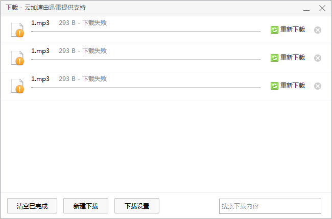

# 用Python下载文件 #

creation date:2020-02-06 16: 37: 16

tag:Python, requests, 下载, headers

## 前提条件 ##

需要事先安装`requests`模块：

- `pip install requests`

## 放码过来 ##

```python
import requests

url = 'XXX' #文件下载来源URL
filename = '' #下载到本地后新文件名
r = requests.get(url)
with open(filename, "wb") as code:
  code.write(r.content)
```

## 实战演习 ##

从目标URL[大电影双语阅读.星际穿越 Interstellar (赠英文音频与单词随身查APP)](http://www.ecustpress.cn/erweima/player.html?blid=11089)下载音频文件。


---

通过浏览器后台分析，可找到音频的URL。


---

其实通过浏览器自带下载功能，应该很容易下载到本地。


---

但是，屡试不行。



---

于是，寻思着，同一浏览器，同样请求URL，为何却得不到想要的结果？

尝试在地址栏输入音频的URL。


**Access Denied, You are denied by bucket referer policy.**

看到被拒的信息后，联想到会不会是**请求头**的缘故呢？

---

于是，浏览器后台查找音频URL的请求头。


有可能是下载器发出请求时没要带上`Referer`等参数而被拒绝连接。

---

是时候发挥Python的强大功力了，在请求下载时请求头带上`Referer`等参数。

```python
headers={
	"Referer": "http://www.ecustpress.cn/erweima/player.html?blid=11089",
	"Accept-Encoding":"identity;q=1, *;q=0",
	"User-Agent":"Mozilla/5.0 (Windows NT 6.1; WOW64) AppleWebKit/537.36 (KHTML, like Gecko) Chrome/78.0.3904.108 Safari/537.36",
	"Range":"bytes=0-"
}

res = requests.get(url % (i + 1), headers=headers)
```

---

另外还发现，目标URL中的所有音频URL尾有很明显的规律：1.mp3、2.mp3、3.mp3...、37.mp3。

于是，一鼓作气将它们下载到本地。

综上所述，最终代码：

```python
import requests
import os
import time
import random

url = "http://hldqrcode1.oss-cn-shanghai.aliyuncs.com/wapaudio/56474/%d.mp3"

headers={
"Referer": "http://www.ecustpress.cn/erweima/player.html?blid=11089",
"Accept-Encoding":"identity;q=1, *;q=0",
"User-Agent":"Mozilla/5.0 (Windows NT 6.1; WOW64) AppleWebKit/537.36 (KHTML, like Gecko) Chrome/78.0.3904.108 Safari/537.36",
"Range":"bytes=0-"
}

for i in range(37):
    
    fileName = ("0" if i + 1 < 10 else "") + ("%d.mp3" % (i + 1))
    
    if os.path.exists(fileName):
        continue

    print "Download %s" % fileName
    
    try:
        res = requests.get(url % (i + 1), headers=headers)
        with open(fileName, "wb") as code:
            code.write(res.content)
        time.sleep(10 * random.random())

    except Exception as err:
        print "Something wrong happens when downloading %s" % fileName
        print err
```

---

码到功成！


## 参考资料 ##

1. [python下载文件的三种方法](https://www.cnblogs.com/x00479/p/11274733.html)

2. [Python——爬虫【Requests设置请求头Headers】](https://blog.csdn.net/ysblogs/article/details/88530124) 