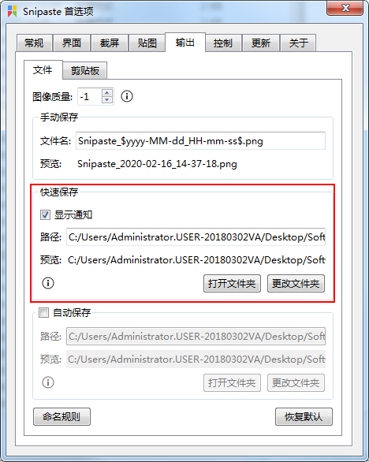

# 用Snipaste和Python实现全局热键快速截图 #

creation date:2020-02-16 14: 14: 10

tag:Snipaste, Python

## 需求概要 ##

最近碰到需要大量截图的事。Snipaste是一款出色的截图软件，并且可以用命令行方式进行截图操作。

Snipaste软件的通常截图步骤：

1. 敲击F1，开始截图。
2. 在屏幕区选择截图范围。
3. 点击保存或敲击Ctrl+S，弹出文件保存对话框。
4. 选择存储目录，编辑文件名称。
5. 点击确定，截图结束。

显然，大量截图乘以5步，这将会耗费操作者不少时间与精力。

因此，简化基本截图步骤将事半功倍。目标：

1. 敲击F4，开始截图。
2. 在屏幕区选择截图范围后，图片以默认的方式命名，存储到指定目录下，截图结束。

## 前提条件 ##

- Snipaste 软件

在Snipaste软件设置快速截图后截图存储目录。



或者在Snipaste安装目录下的默认配置文件`config.ini`中添加或修改快速截图后截图存储目录：

```
[Output]
quick_save_path=C:/Users/Administrator.USER-20180302VA/Desktop/Software/TempImage/Snipaste_$yyyy-MM-dd_HH-mm-ss$.png
```

- 安装pynput模块。该模块提供监听键盘输入功能。

```
pip install pynput
```

## 放码过来 ##

```python
from pynput import keyboard
import subprocess

print "Press F4 to quick-snipaste."

def on_activate():
    print('Global hotkey <F4> activated!')
    subprocess.Popen("C:\Program Files\Snipaste-2.2.4-Beta-x64\Snipaste.exe snip -o quick-save")

def for_canonical(f):
    return lambda k: f(l.canonical(k))

hotkey = keyboard.HotKey(
    keyboard.HotKey.parse('<f4>'),
    on_activate)

with keyboard.Listener(
        on_press=for_canonical(hotkey.press),
        on_release=for_canonical(hotkey.release)) as l:
    l.join()
```

运行代码，敲击F4键，便可快速截图。

注意，初次敲击F4键，可能不能截图，仅是打开Snipaste软件。稍会再次敲击F4键便可截图。

## 参考资料 ##

1. [命令行选项 - Snipaste](https://docs.snipaste.com/zh-cn/command-line-options?id=%e8%b0%83%e7%94%a8%e6%96%b9%e6%b3%95)
2. [Handling the keyboard — pynput 1.6.6 documentation](https://pynput.readthedocs.io/en/latest/keyboard.html#global-hotkeys)