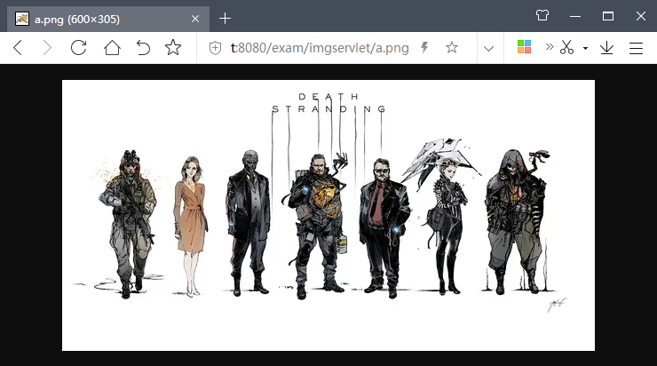

# 用Tomcat构建一个简单图片服务器 #

creation date:2020-02-11 15: 31: 52

tag:Tomcat,servlet

## 前提条件 ##

- Tomcat 7.0.90

## 方法一：修改配置文件 ##

在`TOMCAT_HOME/conf/server.xml`配置文件内的`<Host>`内添加一子标签：

```xml
<Context docBase="C:\exambase\" path="/img"/>
```


## 方法二：添加Servlet ##

新建一应用，然后添加如下的Servlet，然后部署应用并启动Tomcat。

```java
package com.lun.servlet;

import java.io.BufferedInputStream;
import java.io.BufferedOutputStream;
import java.io.FileInputStream;
import java.io.FileNotFoundException;
import java.io.IOException;

import javax.servlet.ServletException;
import javax.servlet.annotation.WebServlet;
import javax.servlet.http.HttpServlet;
import javax.servlet.http.HttpServletRequest;
import javax.servlet.http.HttpServletResponse;


@WebServlet(name = "imgservlet", urlPatterns = { "/imgservlet/*" })
public class ImgServlet extends HttpServlet {
 
	private static final long serialVersionUID = -3351976768417931566L;

	private static final String IMG_PATH = "C:/exambase";
	
	protected void doGet(HttpServletRequest request,
			HttpServletResponse response) throws ServletException, IOException {
		doPost(request, response);
	}
 
	protected void doPost(HttpServletRequest request,
			HttpServletResponse response) throws ServletException, IOException {
		
		String pathInfo = request.getPathInfo();
		try{
	 
			BufferedInputStream in = new BufferedInputStream(new FileInputStream(String.format("%s%s", IMG_PATH, pathInfo)));
			BufferedOutputStream out = new BufferedOutputStream(response.getOutputStream());
			try {
				byte[] content = new byte[in.available()];
				in.read(content);
		 
				response.setContentType("image/png,image/jpeg,image/gif,image/bmp");
				out.write(content);
			}finally {
				in.close();
				out.close();
			}
		}catch(FileNotFoundException ex) {
			throw new IOException(String.format("%s Not Found.", pathInfo));
		}catch(Exception ex) {
			throw ex;			
		}
	}
}
```



## 解决路径含中文时出现乱码问题 ##

本次测试使用的是`Tomcat/7.0.90`，默认解码URL的字符集是`ISO-8859-1`，而浏览器发出URL是用`UTF-8`编码。若URL含中文，乱码现象自然而然会发生。

解决之道：在`TOMCAT_HOME/conf/server.xml`配置文件内的

```xml
<Connector connectionTimeout="20000" port="8080"
	 protocol="HTTP/1.1" redirectPort="8443" />
```

添加一属性`URIEncoding="UTF-8"`。


## 参考资料 ##

1. [tomcat做图片服务器](https://blog.csdn.net/leo187/article/details/79389264)
2. [使用Servlet显示图片](http://www.pianshen.com/article/3891290677/)
3. [Java Servlet @WebServlet Annotation Example](https://www.codejava.net/java-ee/servlet/webservlet-annotation-examples)
4. [Servlet and path parameters like /xyz/{value}/test, how to map in web.xml?](https://stackoverflow.com/questions/8715474/servlet-and-path-parameters-like-xyz-value-test-how-to-map-in-web-xml?noredirect=1)
5. [关于使用Tomcat搭建的Web项目，出现 URL 中文乱码的问题解析](https://www.cnblogs.com/leecong/p/5677263.html)
