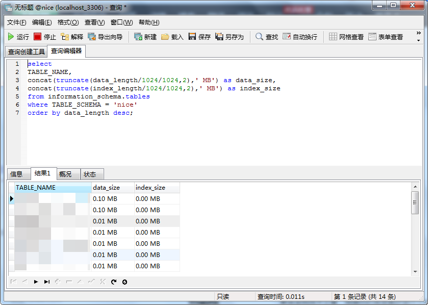

# 统计MySQL中某数据库硬盘占用量大小 #

creation date:2020-03-12 22: 30: 37

tag:MySQL

## 放码过来 ##

```sql
select 
TABLE_NAME, 
concat(truncate(data_length/1024/1024,2),' MB') as data_size,
concat(truncate(index_length/1024/1024,2),' MB') as index_size
from information_schema.tables 
where TABLE_SCHEMA = 'your_db_name'
order by data_length desc;
```
## 运行结果 ##



## 参考资料 ##

[统计MySQL数据库硬盘占用量大小](https://blog.csdn.net/weixin_34186128/article/details/93547040)

