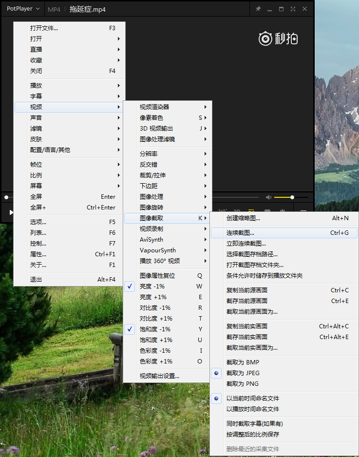
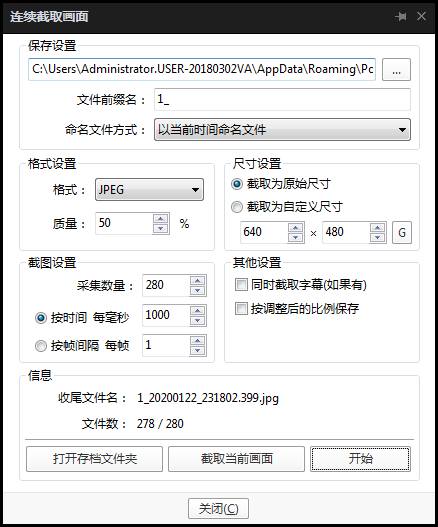
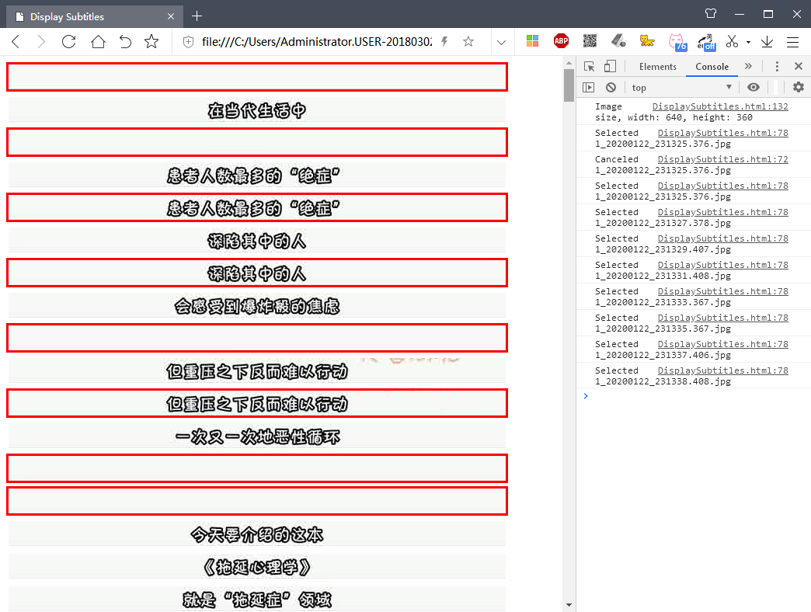
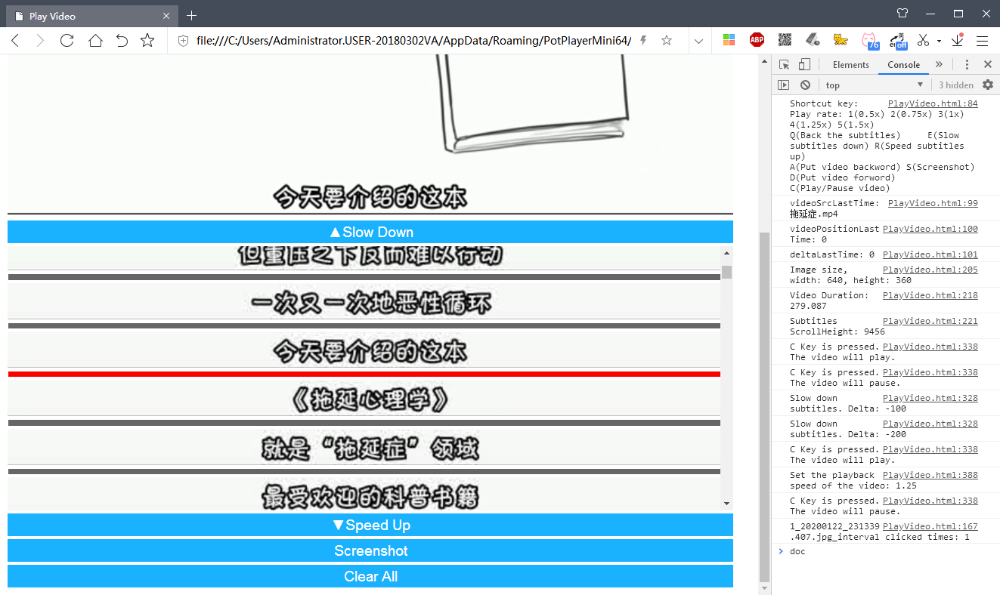

# 视频字幕提取成图的方法总结 #

## 视频字幕提取成图目的 ##

设想一下，你碰到一个好的附带字幕视频，视频字幕文本不能被简单提取，你想根据视频字幕内容做笔记。

通常，你要播放器播放视频到指定的帧时，暂停视频，便开始记录下来字幕，然后再重复播放、暂停、记录一系列动作。如果你只记录一小段字幕，那就还算较轻松。但是，如果你需要记录一大段话，走走停停，十分浪费时间与精力。

于是将视频有字幕的帧提取，将其截取字幕部分并整和成一图，方便日后学习记录。

## 使用到的工具软件 ##

- PotPlayer
- Python 2.7
- 360极速浏览器

## 具体步骤 ##

### 视频按秒截图 ###

用PotPlayer播放器软件播放目标视频，然后右击播放器，弹出菜单，选择 视频->图像截取->连续截图

按需设置参数

点击“开始”，接着播放视频，才能截图。视频播放完毕，截图工作完成。

### 去除重复图片 ###

1. 运行[ListFilename.py](script/ListFilename.py)，生成Variables.js数据文件，供下一步使用；
2. 运行[DisplaySubtitles.html](script/DisplaySubtitles.html)，选择重复的或无效的图片，选择完成接着步骤3；
3. 刷新页面，上一步骤点击选择的图片，在这步不会出现。可以继续选择重复的或无效的图片，再刷新页面，直到无重复项出现；
4. 然后浏览器后台输入`helper.downloadSelectedList()`，保存待删图片文件名单[PrepareToDeleteXXX.txt](#)；
5. 运行[RemoveFiles.py](script/RemoveFiles.py)，它会根据[PrepareToDeleteXXX.txt](#)名单，将待删图片文件移动到[garbage](garbage)文件夹内；
6. 确认无误删后，将[garbage](garbage)文件夹删除。

### 补添遗漏字幕 ###

1. 运行[ListFilename.py](script/ListFilename.py)，生成Variables.js数据文件，供下一步使用；
2. 运行[PlayVideo.html](script/PlayVideo.html)，按需添加遗漏的字幕图片；
3. （可选）运行[ReduceImageSize.py](script/ReduceImageSize.py)将步骤2的保存的图片"减轻体重"；
4. 可跳到步骤1，继续检查是否还有遗漏的字幕图片，直到自己满意为止。

### 整理合并字幕 ###

1. 将需要合并在同一图片的图片放置同一文件夹内，可运行[CreateFolders.py](script/CreateFolders.py)辅助生成文件夹，可运行[MakeWhiteListFiles.py](script/MakeWhiteListFiles.py)辅助生成白名单文件（白名单内的图片将全图截取，而不是只字幕区部分）。
2. 运行[MergeImage.py](script/MergeImage.py)合并文件夹内的图片。

## 展望 ##

1. [整理合并字幕](#整理合并字幕)中可增加一脚本，主要功能是规划好哪些图片到一个文件，以及哪些图片名添加至文件夹内的白名单文件。
2. [去除重复图片](#去除重复图片)中用机器学习，图像识别等技术去除重复图片。
3. [整理合并字幕](#整理合并字幕)中用OCR技术提取出纯文本。
4. 将上述整合成一桌面软件。

