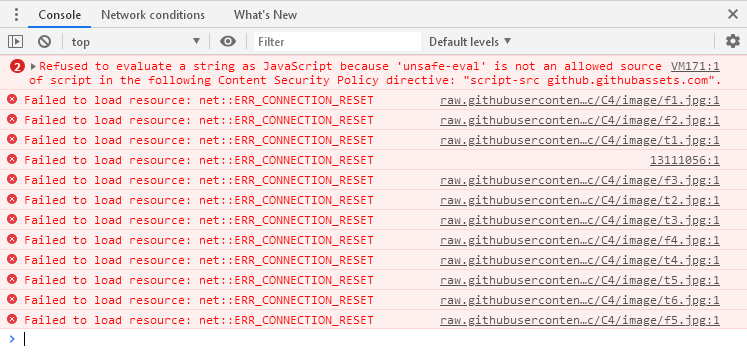

# 解决Github图片加载失败 #

creation date:2020-02-05 11: 56: 42

tag:Github, DSN

## 问题描述 ##

浏览自己Github某仓库的README.md内时，发现文档的图片始终加载不出，打开浏览器后台，冒出一片红，`Failed to load resource: net::ERR_CONNECTION_RESET`，如下图所示：

## 问题分析 ##

可能造成这问题的原因：

- DNS污染
- host设置错误
- ...

## 解决方法 ##

**主要思路**就是使用本地hosts文件对网站进行域名解析，一般的DNS问题都可以通过修改hosts文件来解决，Github的CDN域名被污染问题也不例外，同样可以通过修改hosts文件解决，将域名解析直接指向IP地址来绕过DNS的解析，以此解决污染问题。

---

主要做法是用文本编辑器打开`C:\Windows\System32\drivers\etc\hosts`，在文件末尾处添加

	# GitHub Start

	192.30.253.112    github.com 
	192.30.253.119    gist.github.com
	151.101.184.133    assets-cdn.github.com
	151.101.184.133    raw.githubusercontent.com
	151.101.184.133    gist.githubusercontent.com
	151.101.184.133    cloud.githubusercontent.com
	151.101.184.133    camo.githubusercontent.com
	151.101.184.133    avatars0.githubusercontent.com
	151.101.184.133    avatars1.githubusercontent.com
	151.101.184.133    avatars2.githubusercontent.com
	151.101.184.133    avatars3.githubusercontent.com
	151.101.184.133    avatars4.githubusercontent.com
	151.101.184.133    avatars5.githubusercontent.com
	151.101.184.133    avatars6.githubusercontent.com
	151.101.184.133    avatars7.githubusercontent.com
	151.101.184.133    avatars8.githubusercontent.com

	# GitHub End

## 参考文献 ##

[【最新】解决github图片不显示的问题](https://blog.csdn.net/qq_38232598/article/details/91346392)

