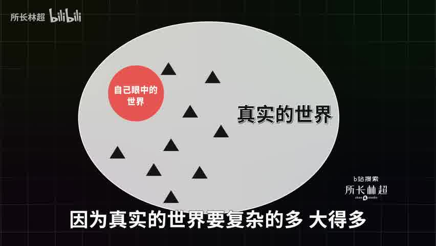
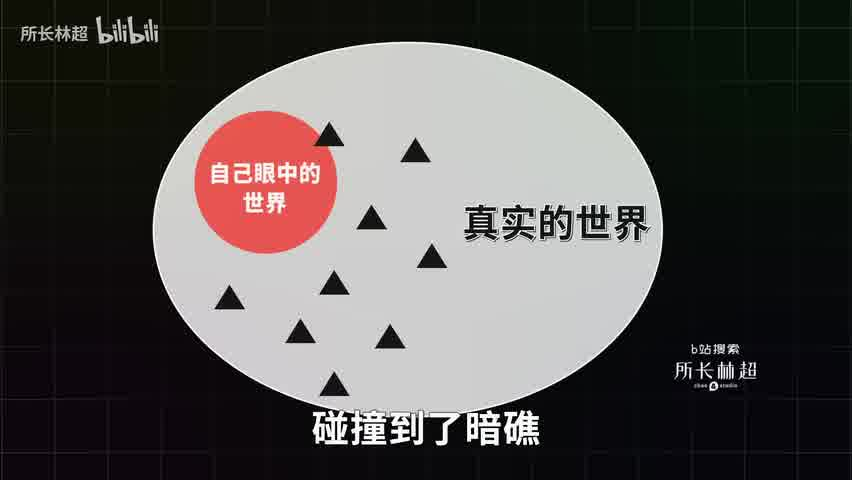
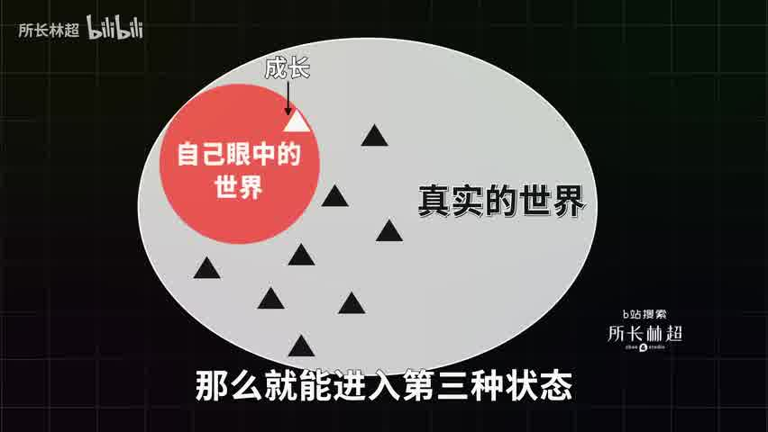
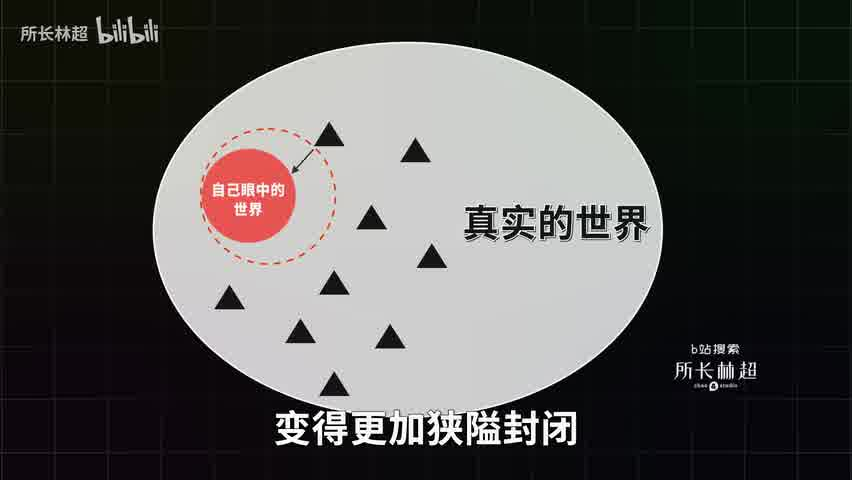
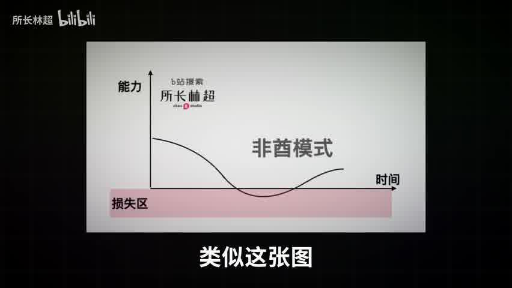
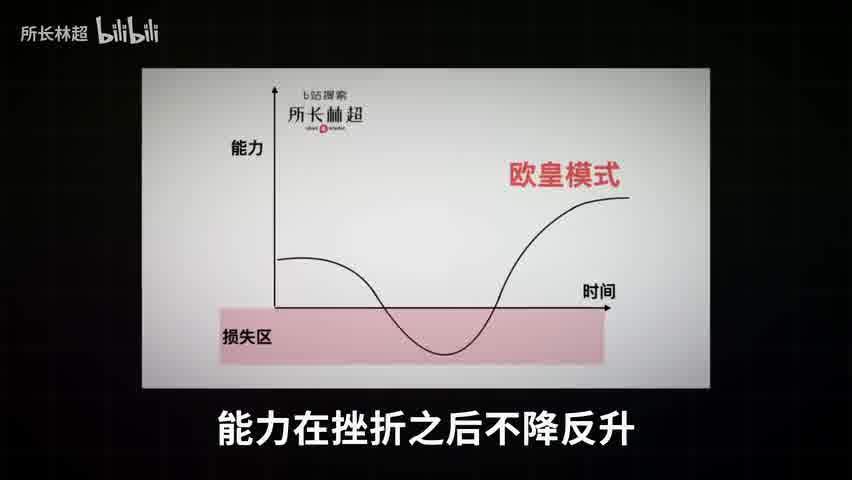
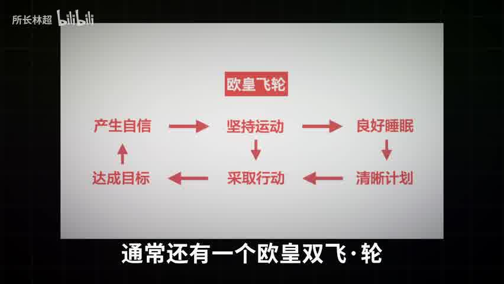
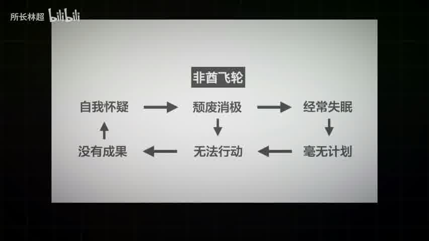
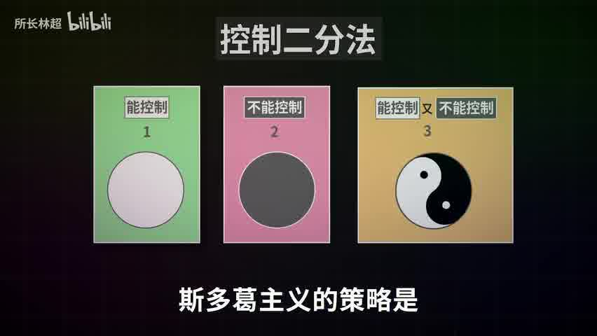
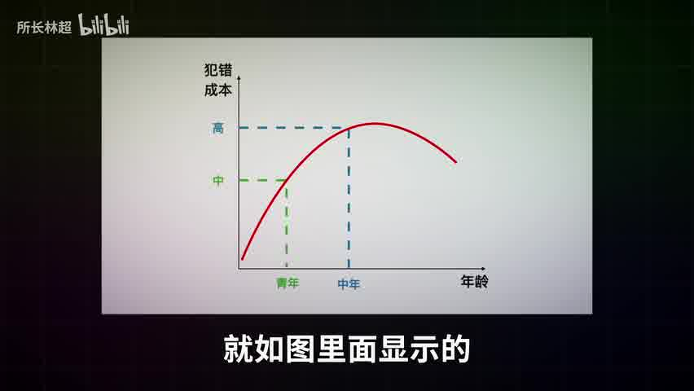

[TOC]

>“自己”这个东西是看不见的，撞上一些别的东西，反弹回来，才会了解“自己”。
>
>所以，跟很强的东西、可怕的东西、水准很高的东西相碰撞，然后才知道“自己”是什么，这才是自我。
>
>——山本耀司

---

>将过去和羁绊全部丢弃，不要吝惜那为了梦想留下的泪水。
>
>——海贼王

## 真实的世界是复杂 ##

我们心目中有一个自以为了解的世界，里面有一套自洽的运行体系，很和谐但也很狭隘，因为真实的世界要复杂的多。

---

每次遇到挫折，其实都是狭隘的自己碰撞到了暗礁，这些暗礁是真实世界的一部分，只是你以前从来不知道，它把我们刺破，让我们流血。

---

如果我们选择不退缩，那么就能进入第三种状态，把原来的刺痛我们的东西，内化成自己身体的一部分，这就是成长。

---

但是如果我们每次触礁，就痛苦的躲回去，就会走上另一种模式，世界会缩小，变得更加狭隘封闭，开始讨厌身边那些标新立异的人，转而喜欢嘲讽和否定一切。

## 面对挫折会开启两种模式 ##

根据Paul Stoltz的《逆商》

他发现人们面对挫折会开启**欧皇**和**非酋**两种完全不同的应对模式。

非酋模式从逆境会变得比之前更差。

能力随时间推移反而下降了。

---

欧皇模式会变得比之前更好。

能力在挫折之后不降反升。

---

造成欧皇和非酋的差别的原由

一个是运气

另一个是你愿意在红色区忍受的时间越长，越不急于摆脱困境，就越能积蓄力量，把握翻盘机遇。

更深一层发现，欧皇们同常有良性循环的双飞轮。

然而非酋们却有一个恶性循环的飞轮。

## 逆境恢复的四个关键变量 ##

从这两个飞轮里，可以看出逆境恢复的四个关键变量

1. 自信
2. 运动
3. 睡眠
4. to do list

---

**自信**

一种现象

1. 自信的人总能翻盘。
2. 自卑的人总是正确。

逆境中能更快走出来的人，通常都有过度自信的倾向，过度自信并不是建立在实事求是的基础上，只是盲目地觉得自己可以，越理性的人越难做到这一点。

过度自信有很多坏处，它在很多地方都会给你带来灾难，但是唯独在对抗逆境的时候，它的好处非常大。因此，尤其推荐那些天性保守在逆境中应该多一些盲目的过度自信。

---

**运动**

运动是公认的最好的抗抑郁与焦虑的良药。

---

**睡眠**

要有良好的睡眠习惯

---

**TO DO LIST**

列清单是人类史上最伟大的时间管理技巧。

推荐书《清单革命》，作者阿图.葛文德。

## 拥抱痛苦的方法论——斯多葛哲学 ##

谁不想要走欧皇模式，但是关键是痛苦令人厌恶。

**躲避痛苦是人类天性，拥抱痛苦却是成长捷径**。

许多经典有讲究痛苦，如《孟子》、《地藏经》等。

其中方法论最清晰的是古希腊的**斯多葛哲学**，它是温总理推崇的一门哲学。

---

斯多葛的控制二分法，就是把生活中的所有事情分成三类：

**第一类**是我们完全能够控制的，比如设定目标，你的目标是赚到100万，或者找到一份高薪工作，又或者是不断成长，这都是完全能控制的，再比如价值观，有人觉得成就就大于家庭，有人觉得折腾好过安逸，也有人完全反过来，这也你能完全控制的。

**第二类**是我们完全不能控制的，比如明天是晴天还是阴天，比如疫情会持续多久，比如中美是否贸易战。

**第三类**是我们能够控制一些，但又不能完全控制的事物，例如，能否升职加薪，能否面试通过，能否创业成功等等。

生活中我们遇到最多最纠结的就是第三类

---

**斯多葛主义的策略**是
1. 对待第一类你能控制的事，100%的专注尽一切的努力去把它做好，
2. 对待第二类你不能控制的事，彻底的忽视，对他们视而不见
3. 对待第三类事情，关键是保持头脑清醒，要把里面你能控制的那部分提炼出来，只集中精力在它上面。

遇到死胡同就是你控制不了的事情，但是选择解决问题另寻出路，还是懊恼纠结丧失斗志，就是你完全可以控制的事情了。

例如，**求职**

求职这件事情也适合用二分法来分析，设定求职目标就是你能完全控制的，你可以把目标设定成求职成功，也可以把目标设定成尽力修炼自己，两者心态截然相反。

如果你想求职成功，那么焦虑就不可避免，因为对方是否聘请你，是你完全不能控制的。

但如果你的目标是尽力修炼自己，从一开始你就只关注认真研究行业，认真投递简历，认真参加面试，认真提问题，认真争取后续机会，即便最终完全没有结果，你的修炼目标也达到了，能抱着这种目标做事情的人，是无敌的。

所以**控制二分法**也被称为无敌法。被众多硅谷大佬所推崇。

想了解更多斯多葛哲学，可阅读William Irvine《像哲学家一样生活》，或《沉思录》。

《三国演义》里有谋事在人，成事在天。

## 珍惜少壮时 ##

犯错成本和年龄之间是呈现U型关系的。

如果一个人年轻的时候，不敢积极地探索自己生命的可能性，那么等人到中年上有老，下有小的，犯错成本大大提高，他的人生轨迹就很难改变了。

所以，少壮不努力，老大徒伤悲

另外，社会有风险，创业需谨慎。

